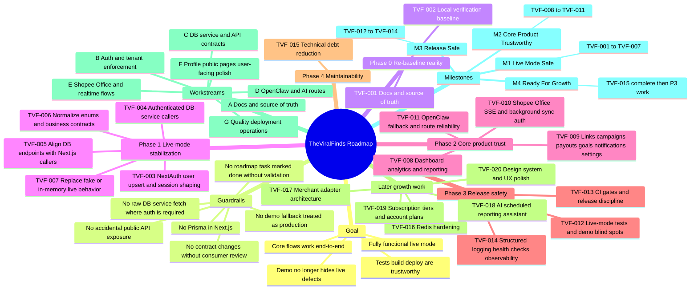

# ROADMAP.md - TheViralFinds Execution Roadmap

> Status: Active
> Last updated: 15 April 2026
> Audience: Humans and AI agents
> Purpose: Give one ordered, practical source of truth for improving the whole project without relying on stale assumptions.

If this file conflicts with `IMPLEMENTATION_PLAN.md`, older audit reports, or optimistic comments inside docs, trust current code first and use this roadmap to choose the next task.

---

## 1. What This File Is For

This roadmap is meant to make future implementation easier, safer, and less repetitive.

It should help an incoming AI agent answer these questions quickly:

1. What is actually broken right now?
2. What should be fixed first?
3. Which files matter for that task?
4. How do we know the task is done?
5. What should be implemented next after that?

This file is not a marketing roadmap. It is an execution roadmap.

---

## 2. Current Reality Snapshot

### What is already in place

- Next.js 16 + React 19 App Router application is structured and sizeable.
- Prisma schema already includes `User`, `Role`, and `userId` relationships.
- DB access is isolated into `mini-services/db-service/` to avoid Turbopack + Prisma issues.
- OpenClaw integration exists as a modular layer under `src/lib/openclaw/`.
- The repo already has docs, scripts, tests, and a broad feature surface.

### What is still unreliable in live mode

- Auth and session shaping are inconsistent across credentials and OAuth flows.
- Several API routes still call the DB service without the authenticated helper.
- Some Next.js API routes call DB endpoints that do not exist.
- Some routes still look "done" in demo mode but are not safe or persistent in live mode.
- Test coverage is too small and too demo-oriented to protect live behavior.
- Some docs claim issues are fixed even when current code still shows drift or partial implementation.

### High-confidence issues seen in current code

- `src/app/api/auth/[...nextauth]/route.ts`
  OAuth sign-in does not fully guarantee `session.user.id` and `session.user.role`.
- `src/lib/api-auth.ts`
  `authenticatedDbFetch()` exists, but not all DB-service callers use it.
- `src/app/api/analytics/route.ts`
  Live mode calls `${DB_URL}/analytics`, but the DB service does not expose `/analytics`.
- `src/app/api/goals/[id]/route.ts`
  Calls `/goals/:id`, but the DB service currently exposes only collection-level `/goals`.
- `src/app/api/goals/[id]/update-progress/route.ts`
  Calls `/goals/:id/update-progress`, but the DB service does not expose it.
- `src/app/api/profile/route.ts`
  Uses an in-memory `Map` and returns a mock profile on GET.
- `middleware.ts`
  Marks `/api/profile` as public.
- `src/app/api/shopee-office/sse/route.ts`
  Background sync fetches `/api/shopee-office/agents` without forwarding auth.
- `src/lib/openclaw/tools.ts`
  Imports `getSDK` from `gateway-client`, but `gateway-client.ts` does not export it.
- `prisma/schema.prisma`
  `GoalStatus` is `active | completed | cancelled`, while parts of API/service logic still use `achieved`.

### Working assumption for execution

The project is not "broken everywhere". It is closer to "broadly built, partially integrated, and not yet fully trustworthy in live mode".

---

## 3. Definition Of "Fully Functional"

The project should only be considered fully functional when all of the following are true:

- `DEMO_MODE=false` and `SKIP_AUTH=false` work for local and staging verification.
- Credentials login and allowed OAuth login both create a valid session with `user.id` and `role`.
- Every DB-service request that needs auth uses the authenticated request path and tenant context.
- Every advertised core route works end-to-end:
  dashboard, links, campaigns, analytics, activity, payouts, goals, notifications, profile, redirect, reports, OpenClaw routes, Shopee Office routes.
- No API route depends on demo-only fallbacks for normal live behavior.
- No public route accidentally exposes private data.
- Test suite covers live-mode auth, DB contract, and major API flows.
- `bun run lint`, `bun run test`, and `bun run build` pass in a reproducible environment.
- Deployment, rollback, and health-check instructions match the actual code.

---

## 4. Non-Negotiable Guardrails

Any AI agent working from this roadmap should follow these rules:

- Never import Prisma directly into Next.js routes. Use the DB service.
- Never add a new DB-service caller with raw `fetch()` if `authenticatedDbFetch()` is required.
- Never treat demo data as a production-ready fallback.
- Never make `/api/*` public unless the route is intentionally public and documented.
- Never change API shapes without checking all consumers.
- Never assume a doc is correct if the current code says otherwise.
- Never mark a roadmap item done without updating acceptance notes and validation results.

---

## 5. How AI Agents Should Use This Roadmap

### Task selection order

1. Pick the highest-priority item whose dependencies are already done.
2. Prefer one roadmap item per working session.
3. If an item is too large, split it into sub-tasks but keep the same roadmap ID prefix.
4. If current code conflicts with this roadmap, update the roadmap after verification.

### Before implementing

Read these first:

- `AGENTS.md`
- This `ROADMAP.md`
- The target files listed in the selected roadmap item
- The nearest tests for the affected area

### After implementing

Record these in the handoff:

- What changed
- Files touched
- Commands run
- What remains risky
- Which roadmap item should be done next

### Status labels

- `Ready`: Can be implemented now.
- `Blocked`: Depends on another roadmap item.
- `In Progress`: Someone is already working on it.
- `Done`: Implemented, validated, and documented.

---

## 6. Suggested Execution Order

### Phase 0 - Re-baseline reality

Goal: Stop future agents from building on stale assumptions.

### Phase 1 - Live-mode stabilization

Goal: Make the existing product safe and functional in `DEMO_MODE=false`.

### Phase 2 - Quality and release safety

Goal: Add enough tests, CI, logging, and deployment discipline to keep the system stable.

### Phase 3 - Performance and maintainability

Goal: Reduce technical debt, improve runtime behavior, and make future work cheaper.

### Phase 4 - Growth features

Goal: Add new value only after the core product is trustworthy.

### Complete roadmap mindmap

Use this when you want one visual view of the whole roadmap without scrolling through every task card.



### Roadmap as text tree

```text
TheViralFinds Roadmap
├─ Goal
│  ├─ Fully functional live mode
│  ├─ No demo-only dependency for normal behavior
│  ├─ Core routes work end-to-end
│  └─ Tests, build, deploy, and rollback are trustworthy
│
├─ Guardrails
│  ├─ No Prisma import in Next.js routes
│  ├─ No unauthenticated DB-service fetch for protected flows
│  ├─ No fake demo behavior treated as production fallback
│  ├─ No accidental public API exposure
│  ├─ No API contract change without checking consumers
│  └─ No task marked done without validation notes
│
├─ Phase 0 - Re-baseline reality
│  ├─ TVF-001 Reconcile docs with current code
│  └─ TVF-002 Restore local verification baseline
│
├─ Phase 1 - Live-mode stabilization
│  ├─ TVF-003 Fix NextAuth user upsert and session shaping
│  ├─ TVF-004 Normalize DB-service callers to authenticated access
│  ├─ TVF-005 Align DB service endpoints with Next.js callers
│  ├─ TVF-006 Normalize status enums and business contracts
│  └─ TVF-007 Replace fake or in-memory live behavior
│
├─ Phase 2 - Core product trustworthy
│  ├─ TVF-008 Stabilize dashboard, analytics, and reporting
│  ├─ TVF-009 Stabilize links, campaigns, payouts, goals, notifications, settings
│  ├─ TVF-010 Fix Shopee Office SSE and background sync auth
│  └─ TVF-011 Repair OpenClaw fallback and route reliability
│
├─ Phase 3 - Release safe
│  ├─ TVF-012 Expand tests around live behavior
│  ├─ TVF-013 Add CI gates and release discipline
│  └─ TVF-014 Add structured logging, health checks, observability
│
├─ Phase 4 - Ready for growth
│  └─ TVF-015 Reduce technical debt and improve maintainability
│
├─ Later growth work
│  ├─ TVF-016 Redis hardening
│  ├─ TVF-017 Merchant adapter architecture
│  ├─ TVF-018 AI-driven scheduled reporting assistant
│  ├─ TVF-019 Subscription tiers and account plans
│  └─ TVF-020 Design system and UX polish pass
│
├─ Workstreams
│  ├─ A Source of truth and docs
│  ├─ B Auth and tenant enforcement
│  ├─ C DB service and API contracts
│  ├─ D OpenClaw and AI routes
│  ├─ E Shopee Office and real-time flows
│  ├─ F Profile, public pages, user-facing polish
│  └─ G Quality, deployment, operations
│
└─ Milestones
   ├─ M1 Live Mode Safe
   │  └─ TVF-001 to TVF-007
   ├─ M2 Core Product Trustworthy
   │  └─ TVF-008 to TVF-011
   ├─ M3 Release Safe
   │  └─ TVF-012 to TVF-014
   └─ M4 Ready For Growth
      └─ TVF-015 complete, then P3 work
```

### How to read the map

- Start with `Phase 0` and `Phase 1` if the goal is a real working live product.
- Treat `TVF-003 -> TVF-004 -> TVF-005` as the fastest critical path.
- Do not start `TVF-016` to `TVF-020` until the earlier milestones are genuinely done.

---

## 7. Workstream Map

### A. Source of truth and docs

- `ROADMAP.md`
- `IMPLEMENTATION_PLAN.md`
- `README.md`
- `docs/ARCHITECTURE.md`
- `docs/API_REFERENCE.md`
- `docs/SECURITY.md`
- `docs/DEPLOYMENT.md`
- `docs/TESTING.md`

### B. Auth and tenant enforcement

- `src/app/api/auth/[...nextauth]/route.ts`
- `src/lib/api-auth.ts`
- `middleware.ts`
- `src/types/next-auth.d.ts`
- `src/lib/db-safe.ts`

### C. DB service and API contracts

- `mini-services/db-service/index.ts`
- `mini-services/db-service/validations.ts`
- `src/app/api/dashboard/route.ts`
- `src/app/api/links/**`
- `src/app/api/campaigns/**`
- `src/app/api/analytics/route.ts`
- `src/app/api/activity/route.ts`
- `src/app/api/payouts/route.ts`
- `src/app/api/goals/**`
- `src/app/api/notifications/route.ts`
- `src/app/api/settings/route.ts`
- `src/app/api/redirect/[shortCode]/route.ts`

### D. OpenClaw and AI routes

- `src/lib/openclaw/gateway-client.ts`
- `src/lib/openclaw/tools.ts`
- `src/lib/openclaw/agents.ts`
- `src/lib/openclaw/ws-client.ts`
- `src/app/api/openclaw/**`

### E. Shopee Office and real-time flows

- `src/app/api/shopee-office/**`
- `src/hooks/use-office-sse.ts`
- `src/components/shopee-office/**`

### F. Profile, public pages, and user-facing polish

- `src/app/api/profile/route.ts`
- `src/app/(dashboard)/**`
- `src/components/pages/**`
- `middleware.ts`

### G. Quality, deployment, and operations

- `src/**/*.test.ts`
- `mini-services/**/*.test.ts`
- `.github/workflows/**`
- `next.config.ts`
- `.env.example`
- `docs/DEPLOYMENT.md`
- `docs/TESTING.md`

---

## 8. Ready Queue

These are the next best tasks to execute in order.

### TVF-001 - Reconcile source-of-truth docs with current code

- Priority: P0
- Status: Ready
- Why: Current docs and implementation drift enough to mislead future agents.
- Files:
  - `ROADMAP.md`
  - `IMPLEMENTATION_PLAN.md`
  - `README.md`
  - `docs/API_REFERENCE.md`
  - `docs/ARCHITECTURE.md`
- Scope:
  - Build a route/contract matrix from actual code.
  - Mark which docs are still aspirational versus implemented.
  - Remove claims that are no longer true.
- Acceptance criteria:
  - Core docs no longer claim routes/features are working when they are not.
  - One document clearly explains what is real, partial, or planned.
- Validation:
  - Manual review of route lists against `src/app/api/**` and `mini-services/db-service/index.ts`.

### TVF-002 - Restore a trustworthy local verification baseline

- Priority: P0
- Status: Ready
- Why: If the repo cannot be verified reliably, later fixes are guesswork.
- Files:
  - `package.json`
  - `src/lib/env.ts`
  - `src/app/api/health/route.ts`
  - `src/lib/service-urls.ts`
  - startup scripts if needed
- Scope:
  - Make sure health/version info matches the repo.
  - Remove misleading service URL logic.
  - Document any Node/Bun/toolchain blocker separately if commands fail before app code runs.
- Acceptance criteria:
  - There is a repeatable path to run app, DB service, notification service, and validation commands.
- Validation:
  - `bun run dev:all`
  - `bun run lint`
  - `bun run test`
  - `bun run build`

### TVF-003 - Fix NextAuth user upsert and session shaping

- Priority: P0
- Status: Ready
- Why: Auth is the root of user scoping and almost every API route depends on it.
- Files:
  - `src/app/api/auth/[...nextauth]/route.ts`
  - `src/lib/api-auth.ts`
  - `src/types/next-auth.d.ts`
  - `src/lib/db-safe.ts`
- Scope:
  - Ensure credentials and OAuth both upsert users through the DB service correctly.
  - Ensure JWT and session always include `user.id`, `email`, and `role`.
  - Remove any path where login "succeeds" but session identity is incomplete.
- Acceptance criteria:
  - `requireAuth()` always sees a valid `userId` for authenticated users.
  - OAuth does not bypass user creation or tenant identity setup.
- Validation:
  - Auth unit tests
  - Manual login test
  - Session inspection in protected routes

### TVF-004 - Normalize all DB-service callers to authenticated access

- Priority: P0
- Status: Ready
- Why: Live mode still contains DB reads that skip auth headers and tenant context.
- Files:
  - `src/lib/api-auth.ts`
  - `src/app/api/dashboard/route.ts`
  - `src/app/api/links/route.ts`
  - `src/app/api/activity/route.ts`
  - `src/app/api/campaigns/route.ts`
  - `src/app/api/notifications/route.ts`
  - any other route calling `process.env.DB_SERVICE_URL`
- Scope:
  - Replace raw `fetch()` calls with `authenticatedDbFetch()` where required.
  - Ensure user context is passed consistently.
  - Ensure `Authorization` and `x-user-id` behavior is consistent.
- Acceptance criteria:
  - No live DB-service route that needs auth uses unauthenticated fetch.
  - Core GET routes work when `DB_SERVICE_SECRET` is enforced.
- Validation:
  - Search for raw DB-service fetch patterns
  - Live route smoke tests for dashboard, links, campaigns, notifications, activity

### TVF-005 - Align DB service endpoints with Next.js API callers

- Priority: P0
- Status: Ready
- Why: Several routes currently point to endpoints that do not exist.
- Files:
  - `mini-services/db-service/index.ts`
  - `mini-services/db-service/validations.ts`
  - `src/app/api/analytics/route.ts`
  - `src/app/api/goals/[id]/route.ts`
  - `src/app/api/goals/[id]/update-progress/route.ts`
  - `src/app/api/settings/route.ts`
- Scope:
  - Decide whether to add missing DB endpoints or simplify Next.js callers to current DB contracts.
  - Ensure CRUD depth matches what pages actually expect.
- Acceptance criteria:
  - Every API route used by the UI calls a real DB endpoint.
  - No route returns success against a missing backend contract.
- Validation:
  - Route-level tests
  - Manual calls to `/api/analytics`, `/api/goals`, `/api/goals/:id`, `/api/goals/:id/update-progress`

### TVF-006 - Normalize status enums and business contracts

- Priority: P0
- Status: Ready
- Why: Data models and API logic disagree on several enums, especially goals.
- Files:
  - `prisma/schema.prisma`
  - `mini-services/db-service/index.ts`
  - `mini-services/db-service/validations.ts`
  - `src/lib/validations.ts`
  - `src/app/api/goals/**`
  - `src/components/pages/earnings-page.tsx`
  - `src/components/pages/dashboard/**`
- Scope:
  - Replace `achieved` versus `completed` drift with one contract.
  - Ensure API responses, DB summaries, UI badges, and seed/demo data all agree.
- Acceptance criteria:
  - One enum vocabulary exists per resource.
  - UI and backend summaries produce the same counts.
- Validation:
  - Goal CRUD tests
  - Manual check of earnings and dashboard goal sections

### TVF-007 - Replace fake or in-memory live behavior with real persistence

- Priority: P0
- Status: Ready
- Why: Several routes look complete but still rely on mock data or process memory.
- Files:
  - `src/app/api/profile/route.ts`
  - `middleware.ts`
  - relevant Prisma schema and DB-service files if profile storage is added
- Scope:
  - Decide whether profile is a real persisted feature or a planned feature.
  - If real, store it in the database and secure public/private access properly.
  - If not real yet, mark it clearly and remove misleading public behavior.
- Acceptance criteria:
  - `/api/profile` is no longer both public and in-memory by accident.
  - Profile data survives restart if the feature is kept.
- Validation:
  - Auth test for private profile mutation
  - Manual create-read-restart-read check

### TVF-008 - Stabilize dashboard, analytics, and reporting flows

- Priority: P1
- Status: Ready
- Why: These are high-visibility product flows and currently mix demo assumptions with incomplete live behavior.
- Files:
  - `src/app/api/dashboard/route.ts`
  - `src/app/api/analytics/route.ts`
  - `src/app/api/activity/route.ts`
  - `src/app/api/reports/generate/route.ts`
  - `src/components/pages/dashboard/**`
  - `src/components/pages/analytics/**`
- Scope:
  - Ensure live analytics are backed by real DB queries or clearly bounded placeholders.
  - Remove broken live-path fetches.
  - Keep demo mode only as an intentional demo path.
- Acceptance criteria:
  - Dashboard and analytics pages load without hidden live-mode failures.
  - Reports do not depend on broken analytics contracts.
- Validation:
  - Manual UI smoke test
  - API tests for dashboard, analytics, activity, reports

### TVF-009 - Stabilize links, campaigns, payouts, goals, notifications, and settings

- Priority: P1
- Status: Ready
- Why: This is the operational core of the product.
- Files:
  - `src/app/api/links/**`
  - `src/app/api/campaigns/**`
  - `src/app/api/payouts/route.ts`
  - `src/app/api/goals/**`
  - `src/app/api/notifications/route.ts`
  - `src/app/api/settings/route.ts`
  - matching DB-service handlers
- Scope:
  - Verify CRUD and list flows end-to-end.
  - Remove drift between API assumptions and DB service behavior.
  - Ensure all write paths validate input before persistence.
- Acceptance criteria:
  - Main dashboard workflow resources work in live mode.
  - No resource page depends on a missing endpoint or invalid enum.
- Validation:
  - Integration tests for CRUD flows
  - Manual UI checks for each page

### TVF-010 - Fix Shopee Office SSE and background sync auth

- Priority: P1
- Status: Ready
- Why: Current SSE sync can silently fail when protected routes require auth.
- Files:
  - `src/app/api/shopee-office/sse/route.ts`
  - `src/app/api/shopee-office/agents/**`
  - `src/hooks/use-office-sse.ts`
  - `middleware.ts`
- Scope:
  - Use a safe internal fetch strategy or move update sourcing away from unauthenticated self-fetch.
  - Make background failures observable.
- Acceptance criteria:
  - Agent Office receives stable updates without hidden 401s.
  - Background sync failures are visible in logs.
- Validation:
  - Manual SSE session test
  - Console/log verification

### TVF-011 - Repair OpenClaw fallback and route reliability

- Priority: P1
- Status: Ready
- Why: OpenClaw is a major feature area, and current fallback/import drift reduces trust.
- Files:
  - `src/lib/openclaw/gateway-client.ts`
  - `src/lib/openclaw/tools.ts`
  - `src/lib/openclaw/agents.ts`
  - `src/lib/openclaw/ws-client.ts`
  - `src/app/api/openclaw/**`
- Scope:
  - Resolve `getSDK` contract mismatch.
  - Confirm default model naming and fallback behavior.
  - Ensure tool discovery, invocation, streaming, and agent orchestration behave predictably.
- Acceptance criteria:
  - OpenClaw routes either work against the gateway or fail in a clear, typed, recoverable way.
  - Fallback code path is valid and test-covered.
- Validation:
  - Unit tests for gateway client and tool fallback
  - Manual checks for discover, ai-content, stream, mcp-proxy

### TVF-012 - Expand tests around live behavior and remove demo-mode blind spots

- Priority: P1
- Status: Ready
- Why: Current test coverage is too small and too biased toward demo mode.
- Files:
  - `src/app/api/api-routes.test.ts`
  - `mini-services/db-service/**/*.test.ts`
  - `src/lib/openclaw/**/*.test.ts`
  - new test files under `src/app/api/**`
- Scope:
  - Add tests for auth/session shaping.
  - Add DB-service contract tests.
  - Add high-value API route tests in live mode.
  - Stop forcing only `DEMO_MODE=true` in broad API tests.
- Acceptance criteria:
  - Priority 1 auth and DB contract tests exist.
  - Core routes have live-mode coverage.
- Validation:
  - `bun run test`
  - `bun run test:coverage`

### TVF-013 - Add CI gates and release discipline

- Priority: P1
- Status: Ready
- Why: Stability work is wasted if regressions merge easily.
- Files:
  - `.github/workflows/**`
  - docs updates for validation and deployment
- Scope:
  - Add lint, test, and build gates.
  - Add a minimal smoke/deploy checklist.
  - Capture rollback expectations.
- Acceptance criteria:
  - Pull requests have automated quality gates.
  - Release docs match actual commands and services.
- Validation:
  - CI run results
  - Manual dry run of documented steps

### TVF-014 - Add structured logging, health checks, and runtime observability

- Priority: P2
- Status: Ready
- Why: Silent failures currently make diagnosis slower than it should be.
- Files:
  - `src/app/api/health/route.ts`
  - `mini-services/db-service/index.ts`
  - `src/lib/openclaw/**`
  - deployment docs
- Scope:
  - Replace ad-hoc console usage in critical flows with structured logs.
  - Improve health-check detail for app, DB service, and OpenClaw.
  - Add error categories that help future agents debug faster.
- Acceptance criteria:
  - Major failures surface enough context to diagnose quickly.
  - Health endpoints reflect real dependency state.
- Validation:
  - Manual failure injection
  - Health endpoint verification

### TVF-015 - Reduce technical debt and improve maintainability

- Priority: P2
- Status: Ready
- Why: Some large files and stale helpers are slowing down safe implementation.
- Files:
  - `src/lib/service-urls.ts`
  - dead or duplicated helpers under `src/lib/`
  - oversized page/components
  - asset-heavy public folders
- Scope:
  - Remove dead code and duplicated helpers.
  - Split oversized components.
  - Revisit asset delivery for `public/shopee-office/`.
- Acceptance criteria:
  - Fewer dead paths and smaller maintenance hotspots.
  - New agents can navigate the codebase with less confusion.
- Validation:
  - Build/test pass
  - Manual code review of reduced duplication

---

## 9. Blocked Or Later Work

These are good improvements, but they should not be done before the ready queue above is under control.

### TVF-016 - Redis hardening and distributed cache/rate limit alignment

- Priority: P2
- Status: Blocked by live-mode stabilization
- Notes:
  - Redis helpers already exist in the repo, but rollout should follow contract stabilization and better tests.

### TVF-017 - Merchant adapter architecture

- Priority: P3
- Status: Blocked by core product stabilization
- Suggestion:
  - Introduce a merchant adapter layer before adding Lazada or TikTok Shop so each integration does not leak provider-specific logic into page and API code.

### TVF-018 - AI-driven scheduled reporting and analytics assistant

- Priority: P3
- Status: Blocked by stable analytics contracts
- Suggestion:
  - Only add scheduled reports and natural-language analytics after dashboard and analytics data are trustworthy.

### TVF-019 - Subscription tiers and account plans

- Priority: P3
- Status: Blocked by auth and tenant enforcement hardening
- Suggestion:
  - Add billing only after user identity, roles, and tenant scoping are fully stable.

### TVF-020 - Design system and UX polish pass

- Priority: P3
- Status: Blocked by core flow stability
- Suggestion:
  - After reliability work, unify visual patterns, empty states, destructive-action confirmations, and loading/error states across dashboard pages.

---

## 10. Strategic Improvement Suggestions For The Whole Project

These are not immediate P0 tasks, but they are high-value suggestions once the product is stable.

### Product architecture suggestions

- Add an explicit profile model instead of mixing public profile ideas into a generic mock route.
- Introduce a route contract table for every Next.js API route and DB-service handler.
- Separate "demo fixtures" from "live fallback" so demo logic never bleeds into production behavior.
- Standardize API response envelopes for list, detail, error, and mutation responses.

### Data layer suggestions

- Add a small repository/service layer for DB-service handlers once contracts are stable.
- Replace mixed ad-hoc aggregate logic with shared query helpers for dashboard and analytics.
- Add migration discipline and stop relying on docs that assume schema work is complete without verification.

### AI integration suggestions

- Add typed gateway error classes for auth failure, circuit open, timeout, and bad payload.
- Add a small compatibility layer for SDK fallback so route code does not know fallback internals.
- Add one canonical "agent discovery + tool discovery" contract and reuse it everywhere.

### Quality suggestions

- Add contract tests for all core DB-service endpoints.
- Add live-mode smoke tests that run with auth enabled and demo mode disabled.
- Add a "docs drift" checklist to PR review for any route, env, or deployment change.

### Operations suggestions

- Add structured logs with request IDs in app and mini-services.
- Add backup/restore verification notes, not just backup commands.
- Add health dashboards for app, DB service, notification service, and OpenClaw.

### Developer experience suggestions

- Add a single "first 30 minutes" setup section for new contributors and AI agents.
- Add a "known fake/demo-only areas" section in docs so agents stop treating them as production complete.
- Add a ready-to-copy task template in this roadmap and require agents to reference roadmap IDs.

---

## 11. Agent Task Template

When an AI agent picks up a roadmap item, it should frame work like this:

```md
Roadmap ID: TVF-00X
Goal: <one sentence>
Why now: <why this task is next>
Files to read first:
- <file 1>
- <file 2>

Plan:
1. <step>
2. <step>
3. <step>

Validation:
- <command>
- <manual check>

Handoff:
- Changed files:
- Commands run:
- Result:
- Remaining risk:
- Next suggested roadmap item:
```

---

## 12. Update Protocol

Whenever a roadmap item moves forward:

- Change its status.
- Add or adjust the acceptance notes if scope changed.
- Update docs if the real contract changed.
- Point to the next best task so future agents do not have to rediscover sequencing.

If a task uncovers a bigger blocker:

- Do not hide it inside a code comment.
- Add the blocker here with a new roadmap ID or a dependency note.

---

## 13. Completion Milestones

Use these as the big checkpoints.

### Milestone M1 - Live Mode Safe

- TVF-001 through TVF-007 are done.
- Core auth and DB contracts are stable.

### Milestone M2 - Core Product Trustworthy

- TVF-008 through TVF-011 are done.
- Main user workflows work end-to-end.

### Milestone M3 - Release Safe

- TVF-012 through TVF-014 are done.
- Tests, CI, logs, and deployment guidance are reliable.

### Milestone M4 - Ready For Growth

- TVF-015 is done.
- P3 features can be added without building on unstable foundations.

---

## 14. First Recommendation For The Next Agent

If no one gives a more specific instruction, the next best task is:

1. `TVF-003` - Fix NextAuth user upsert and session shaping
2. `TVF-004` - Normalize all DB-service callers to authenticated access
3. `TVF-005` - Align DB service endpoints with Next.js API callers

That sequence gives the fastest path toward a genuinely working live mode.
