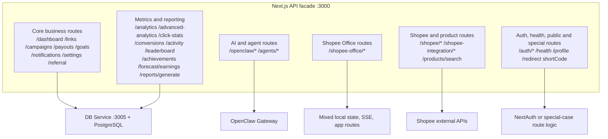

# API Reference

> Reference for the current Next.js API surface in TheViralFinds.

> Reality check (15 April 2026):
> This file mixes intended route surface with the current implementation. Treat the code as the final contract, especially for `/api/analytics`, `/api/goals/[id]`, `/api/goals/[id]/update-progress`, and `/api/profile`.

---

## Overview

- **Base URL**: `http://localhost:3000/api` (development)
- **Authentication**: NextAuth JWT session (cookie-based)
- **Rate Limits**: 60 req/min (read), 30 req/min (write), 10 req/min (AI)
- **Response Format**: JSON
- **Error Format**: `{ error: 'message' }`

### Verified contract drift

- `/api/analytics` exists at the Next.js layer, but the current DB service does not expose `/analytics`.
- `/api/goals/[id]` and `/api/goals/[id]/update-progress` exist at the Next.js layer, but the current DB service does not yet expose matching item-level goal endpoints.
- `/api/profile` is marked protected below, but `middleware.ts` currently treats `/api/profile` as public and the route still uses mock/in-memory behavior.
- The DB service table later in this file is the safer reference for currently implemented collection-level endpoints.

---

## Quick Route Map

Use this section first if you want to know where a route really goes before reading the detailed endpoint list below.



### Route families at a glance

| Family | Main paths | Primary backend | Status note |
|---|---|---|---|
| Core DB-backed CRUD | `/dashboard`, `/links`, `/campaigns`, `/payouts`, `/goals`, `/notifications`, `/settings`, `/referral` | DB service | Main live app path |
| Metrics and derived stats | `/analytics`, `/advanced-analytics`, `/click-stats`, `/conversions`, `/activity`, `/leaderboard`, `/achievements`, `/forecast/earnings`, `/reports/generate` | Mostly DB service + route-layer shaping | Some contract drift still exists |
| AI and orchestration | `/openclaw/*`, `/agents/*` | `src/lib/openclaw/*` -> OpenClaw Gateway | Verify fallback/export behavior in code |
| Shopee Office / game | `/shopee-office/*` | Mixed local state, SSE, route handlers | Not a pure DB-service slice |
| Shopee external integration | `/shopee/*`, `/shopee-integration/*`, `/products/search` | `src/lib/shopee/*` | Depends on external service credentials |
| Platform and public | `/auth/*`, `/health`, `/profile`, `/redirect/[shortCode]` | NextAuth or special-case route logic | `/profile` is currently misleading in live mode |

### Fast navigation for agents

- If you need standard live data CRUD, jump to sections `1`, `2`, `3`, `5`, `6`, and `7`.
- If you need OpenClaw behavior, jump to section `8` and then verify `src/lib/openclaw/*`.
- If you need game, SSE, or office-state behavior, jump to section `9`.
- If you need external commerce integration, jump to section `10` and verify `src/lib/shopee/*`.
- If you need the real runtime map first, open [MASTER_STRUCTURE.md](./MASTER_STRUCTURE.md).

---

## Rate Limits by Tier

| Tier | Limit | Window | Endpoints |
|------|-------|--------|-----------|
| **Read** | 60 req/min | 60s | GET requests |
| **Write** | 30 req/min | 60s | POST, PUT, DELETE |
| **AI** | 10 req/min | 60s | OpenClaw AI routes |
| **Auth** | 5 req/min | 5 min | Login, signup |

---

## 1. Dashboard

| Method | Endpoint | Description | Auth |
|--------|----------|-------------|------|
| GET | `/api/dashboard` | Get dashboard statistics | ✅ |

### GET /api/dashboard

Retrieve comprehensive dashboard analytics.

**Query Parameters**:

- `period` (string): `7d`, `30d`, `90d`, `month`, `all` (default: `30d`)

**Response** (200 OK):

```json
{
  "totalLinks": 150,
  "totalClicks": 25000,
  "totalConversions": 500,
  "totalEarnings": 1250.50,
  "conversionRate": 2.0,
  "earningsData": [
    { "date": "2026-04-01", "earnings": 45.50, "clicks": 120 }
  ],
  "topLinks": [...],
  "recentConversions": [...],
  "countryData": [
    { "name": "Malaysia", "value": 15000 }
  ],
  "performanceScore": 75,
  "performanceGrade": "C",
  "scoreBreakdown": [...]
}
```

---

## 2. Affiliate Links

| Method | Endpoint | Description | Auth |
|--------|----------|-------------|------|
| GET | `/api/links` | List links with pagination | ✅ |
| POST | `/api/links` | Create new affiliate link | ✅ |
| GET | `/api/links/[id]` | Get single link details | ✅ |
| PUT | `/api/links/[id]` | Update link | ✅ |
| DELETE | `/api/links/[id]` | Delete link | ✅ |
| GET | `/api/links/[id]/stats` | Get link statistics | ✅ |
| GET | `/api/links/[id]/share` | Get sharing options | ✅ |
| GET | `/api/links/qr-code` | Generate QR code | ✅ |
| PUT | `/api/links/bulk` | Bulk update links | ✅ |
| DELETE | `/api/links/bulk` | Bulk delete links | ✅ |

### GET /api/links

**Query Parameters**:

- `page` (number): Page number (default: 1)
- `limit` (number): Items per page (default: 10)
- `status` (string): `all`, `active`, `paused`, `expired`
- `campaignId` (string): Filter by campaign
- `search` (string): Search by name, product, shortCode

**Response** (200 OK):

```json
{
  "links": [...],
  "campaigns": [...],
  "pagination": {
    "page": 1,
    "limit": 10,
    "total": 150,
    "totalPages": 15
  }
}
```

### POST /api/links

**Validation Schema** (`createLinkSchema`):

```typescript
{
  name: z.string().min(1).max(200),
  productUrl: z.string().url(),
  affiliateUrl: z.string().url().optional(),
  productId: z.string().optional(),
  productName: z.string().optional(),
  productImage: z.string().optional(),
  productPrice: z.coerce.number().positive().optional(),
  commission: z.coerce.number().min(0).optional(),
  category: z.string().optional(),
  campaignId: z.string().optional(),
  shortCode: z.string().optional(),
  status: z.enum(['active', 'paused', 'expired']).default('active'),
  expiresAt: z.string().datetime().optional()
}
```

**Response** (201 Created):

```json
{
  "id": "clx123",
  "name": "Gaming Mouse",
  "affiliateUrl": "https://shopee.com.my/...",
  "shortCode": "link-abc123",
  "status": "active",
  "createdAt": "2026-04-12T10:00:00.000Z"
}
```

---

## 3. Campaigns

| Method | Endpoint | Description | Auth |
|--------|----------|-------------|------|
| GET | `/api/campaigns` | List all campaigns | ✅ |
| POST | `/api/campaigns` | Create campaign | ✅ |
| PUT | `/api/campaigns/[id]` | Update campaign | ✅ |
| DELETE | `/api/campaigns/[id]` | Delete campaign | ✅ |

### POST /api/campaigns

**Validation Schema** (`createCampaignSchema`):

```typescript
{
  name: z.string().min(1).max(200),
  description: z.string().max(1000).optional(),
  status: z.enum(['active', 'paused', 'completed']).default('active'),
  budget: z.coerce.number().positive().optional(),
  startDate: z.string().datetime().optional(),
  endDate: z.string().datetime().optional()
}
```

---

## 4. Analytics

| Method | Endpoint | Description | Auth |
|--------|----------|-------------|------|
| GET | `/api/analytics` | Advanced analytics | ✅ |
| GET | `/api/click-stats` | Click statistics | ✅ |
| GET | `/api/conversions` | List conversions | ✅ |
| GET | `/api/activity` | Recent activity feed | ✅ |
| GET | `/api/leaderboard` | Top performing links | ✅ |
| GET | `/api/achievements` | User achievements | ✅ |

---

## 5. Financial

| Method | Endpoint | Description | Auth |
|--------|----------|-------------|------|
| GET | `/api/payouts` | List payouts with summary | ✅ |
| POST | `/api/payouts` | Request payout | ✅ |
| GET | `/api/goals` | List earning goals | ✅ |
| POST | `/api/goals` | Create goal | ✅ |
| PUT | `/api/goals/[id]` | Update goal | ✅ |
| DELETE | `/api/goals/[id]` | Delete goal | ✅ |
| PUT | `/api/goals/[id]/update-progress` | Update goal progress | ✅ |

### POST /api/payouts

**Validation Schema** (`createPayoutSchema`):

```typescript
{
  method: z.enum(['bank_transfer', 'ewallet']).default('bank_transfer'),
  amount: z.coerce.number().min(100), // Minimum RM 100
  bankName: z.string().min(1).optional(),
  accountNo: z.string().min(1).optional(),
  accountName: z.string().min(1).optional(),
  note: z.string().max(500).optional()
}
```

---

## 6. Notifications

| Method | Endpoint | Description | Auth |
|--------|----------|-------------|------|
| GET | `/api/notifications` | List notifications | ✅ |
| PUT | `/api/notifications` | Mark all as read | ✅ |

**Query Parameters** (GET):

- `filter` (string): `all`, `unread`, `conversions`, `payouts`

---

## 7. Settings

| Method | Endpoint | Description | Auth |
|--------|----------|-------------|------|
| GET | `/api/settings` | Get app settings | ✅ |
| PUT | `/api/settings` | Update settings | ✅ |

### PUT /api/settings

**Body**:

```json
{
  "updates": [
    { "key": "theme", "value": "dark" },
    { "key": "notifications", "value": "enabled" }
  ]
}
```

---

## 8. OpenClaw AI Integration

| Method | Endpoint | Description | Auth |
|--------|----------|-------------|------|
| GET | `/api/openclaw/discover` | Discover available agents | ✅ |
| POST | `/api/openclaw/ai-content` | Generate AI content | ✅ |
| POST | `/api/openclaw/ai-insights` | Get AI insights | ✅ |
| POST | `/api/openclaw/analyze` | AI analysis | ✅ |
| POST | `/api/openclaw/stream` | Streaming AI response | ✅ |
| POST | `/api/openclaw/trending` | Trending products | ✅ |
| POST | `/api/openclaw/competitor` | Competitor analysis | ✅ |
| POST | `/api/openclaw/price-track` | Price tracking | ✅ |
| POST | `/api/openclaw/web-reader` | Web page analysis | ✅ |
| POST | `/api/openclaw/ai-keywords` | Keyword research | ✅ |
| POST | `/api/openclaw/smart-scheduler` | AI scheduling | ✅ |
| POST | `/api/openclaw/hooks` | Execute webhook | ✅ |
| GET | `/api/openclaw/cron` | List cron jobs | ✅ |
| POST | `/api/openclaw/cron` | Create cron job | ✅ |
| DELETE | `/api/openclaw/cron` | Delete cron job | ✅ |
| GET | `/api/openclaw/mcp-proxy` | MCP tool discovery | ✅ |
| POST | `/api/openclaw/mcp-proxy` | Invoke MCP tool | ✅ |
| GET | `/api/openclaw/a2a-proxy` | A2A protocol proxy | ✅ |
| POST | `/api/openclaw/a2a-proxy` | A2A protocol proxy | ✅ |
| GET | `/api/openclaw/ws-status` | WebSocket status | ✅ |

### POST /api/openclaw/ai-content

**Body**:

```json
{
  "agentId": "niagaresearch",
  "prompt": "Analyze trending products in electronics",
  "sessionKey": "session-123"
}
```

**Rate Limit**: 10 req/min

---

## 9. Shopee Office Game

| Method | Endpoint | Description | Auth |
|--------|----------|-------------|------|
| GET | `/api/shopee-office/status` | Get game state | ✅ |
| POST | `/api/shopee-office/status` | Update game state | ✅ |
| GET | `/api/shopee-office/join` | Join game | ✅ |
| POST | `/api/shopee-office/join` | Create player | ✅ |
| GET | `/api/shopee-office/memo` | Get memo board | ✅ |
| GET | `/api/shopee-office/agents` | List agents | ✅ |
| POST | `/api/shopee-office/agents` | Create agent | ✅ |
| GET | `/api/shopee-office/agents/[id]` | Get agent details | ✅ |
| POST | `/api/shopee-office/agents/[id]` | Update agent | ✅ |
| POST | `/api/shopee-office/agents/[id]/approve` | Approve agent | ✅ |
| POST | `/api/shopee-office/agents/[id]/leave` | Remove agent | ✅ |
| GET | `/api/shopee-office/guest-agents` | List guest agents | ✅ |

---

## 10. Shopee Integration

| Method | Endpoint | Description | Auth |
|--------|----------|-------------|------|
| GET | `/api/shopee/products` | List Shopee products | ✅ |
| GET | `/api/shopee/shop` | Get shop details | ✅ |
| POST | `/api/shopee/shop` | Update shop | ✅ |
| GET | `/api/shopee/orders` | List orders | ✅ |
| GET | `/api/shopee/shipping` | Get shipping options | ✅ |
| GET | `/api/shopee/promotions` | List promotions | ✅ |
| POST | `/api/shopee/promotions` | Create promotion | ✅ |
| GET | `/api/shopee/affiliate` | Affiliate API access | ✅ |
| POST | `/api/shopee/affiliate` | Create affiliate link | ✅ |
| GET | `/api/shopee/ams` | Get AMS campaigns | ✅ |
| POST | `/api/shopee/ams` | Create AMS campaign | ✅ |
| POST | `/api/shopee-integration/search` | Search products | ✅ |
| POST | `/api/shopee-integration/import` | Import products | ✅ |

---

## 11. System

| Method | Endpoint | Description | Auth |
|--------|----------|-------------|------|
| GET | `/api/health` | Health check | ❌ |
| GET | `/api/` | API root | ❌ |
| GET | `/api/redirect/[shortCode]` | Redirect affiliate link | ❌ |
| GET | `/api/profile` | Get user profile | ⚠️ Inconsistent |
| POST | `/api/profile` | Update user profile | ⚠️ Inconsistent |
| GET | `/api/referral` | Get referral info | ✅ |
| GET | `/api/social-scheduler` | List scheduled posts | ✅ |
| POST | `/api/social-scheduler` | Schedule post | ✅ |
| GET | `/api/reports/generate` | Generate report | ✅ |
| POST | `/api/reports/generate` | Generate custom report | ✅ |
| POST | `/api/calculator/estimate` | Calculate earnings estimate | ✅ |
| GET | `/api/forecast/earnings` | Earnings forecast | ✅ |
| GET | `/api/products/search` | Search products | ✅ |

---

## DB Service Endpoints (port 3005)

Internal microservice endpoints at `http://127.0.0.1:3005`:

Verified 15 April 2026:

- The current DB service exposes collection-level `/goals` endpoints, not `/goals/:id` or `/goals/:id/update-progress`.
- The current DB service does not expose `/analytics`.

| Method | Endpoint | Description | Auth |
|--------|----------|-------------|------|
| GET | `/health` | Health check | ❌ |
| GET | `/dashboard/stats` | Dashboard analytics | ✅ |
| GET | `/links` | List links | ✅ |
| POST | `/links` | Create link | ✅ |
| GET | `/links/[id]` | Get link | ✅ |
| PUT | `/links/[id]` | Update link | ✅ |
| DELETE | `/links/[id]` | Delete link | ✅ |
| GET | `/links/[id]/stats` | Link statistics | ✅ |
| GET | `/campaigns` | List campaigns | ✅ |
| POST | `/campaigns` | Create campaign | ✅ |
| GET | `/notifications` | List notifications | ✅ |
| PUT | `/notifications` | Mark all read | ✅ |
| GET | `/payouts` | List payouts | ✅ |
| POST | `/payouts` | Create payout | ✅ |
| GET | `/goals` | List goals | ✅ |
| POST | `/goals` | Create goal | ✅ |
| GET | `/settings` | Get settings | ✅ |
| PUT | `/settings` | Update settings | ✅ |
| GET | `/activity` | Activity feed | ✅ |
| GET | `/click-stats` | Click statistics | ✅ |
| GET | `/conversions` | List conversions | ✅ |
| GET | `/redirect/[shortCode]` | Redirect link | ✅ |

---

## Validation Schemas

All Zod schemas are defined in:

- `src/lib/validations.ts` — Next.js API routes
- `mini-services/db-service/validations.ts` — DB Service endpoints

Key schemas:

- `createLinkSchema` — Create affiliate link
- `updateLinkSchema` — Update link
- `createCampaignSchema` — Create campaign
- `createPayoutSchema` — Request payout
- `createGoalSchema` — Create earning goal
- `updateSettingsSchema` — Update settings
- `bulkActionSchema` — Bulk operations
- `bulkDeleteSchema` — Bulk delete
- `loginSchema` — User login

---

## Error Responses

| Status Code | Description |
|-------------|-------------|
| 400 | Bad Request — Invalid input |
| 401 | Unauthorized — Not authenticated |
| 403 | Forbidden — Insufficient permissions |
| 404 | Not Found — Resource doesn't exist |
| 429 | Too Many Requests — Rate limit exceeded |
| 500 | Internal Server Error |

**Error Format**:

```json
{
  "error": "Validation failed: name is required"
}
```

---

*Last updated: 15 April 2026*
