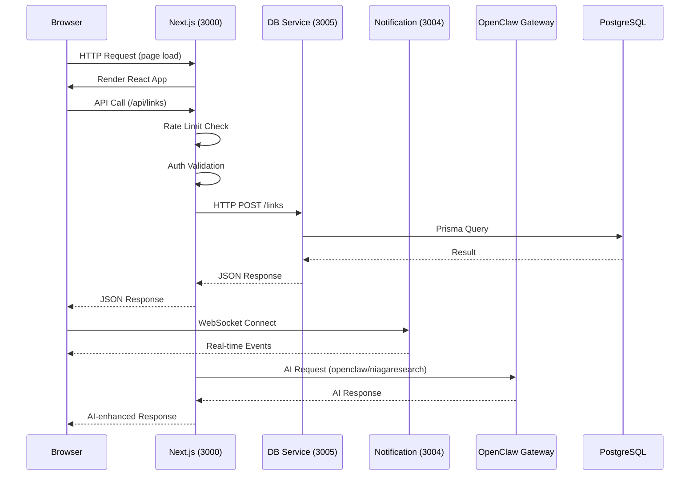

# Architecture

> System design, data flow, and architectural invariants for TheViralFinds.

> Reality check (15 April 2026):
> This document is a high-level map, not an exact route contract. For implementation work, verify against `ROADMAP.md`, `prisma/schema.prisma`, `src/app/api/**`, and `mini-services/db-service/index.ts`.

---

## Overview

TheViralFinds is a Shopee affiliate link management platform built with **Next.js 16**, **React 19**, **TypeScript**, and **PostgreSQL 16**. It features a **3-process microservices architecture** to work around Next.js 16 + Turbopack limitations with Prisma.

---

## 3-Process Architecture

The application runs three concurrent processes:

| Process | Port | Technology | Role |
|---------|------|------------|------|
| **Next.js App** | 3000 | Next.js 16 + React 19 | Frontend UI, API routes, authentication |
| **DB Service** | 3005 | Bun.serve() + Prisma | Direct database operations (bypasses Turbopack Prisma issue) |
| **Notification Service** | 3004 | Bun.serve() + Socket.IO | Real-time events, WebSocket connections |

### Why 3 Processes?

Next.js 16 with Turbopack hangs when importing Prisma Client directly. The workaround:

- DB Service runs as a separate Bun process with direct Prisma access
- Next.js API routes call DB Service via HTTP (`http://127.0.0.1:3005`)
- This isolates Prisma from Turbopack's compilation pipeline

---

## Technology Stack

### Frontend

- **Framework**: Next.js 16 (App Router)
- **UI Library**: React 19
- **Styling**: Tailwind CSS v4
- **Components**: shadcn/ui (Radix UI primitives)
- **State Management**: Zustand
- **Data Fetching**: @tanstack/react-query
- **Animations**: Framer Motion
- **Charts**: Recharts

### Backend

- **Runtime**: Node.js 18+ / Bun
- **Database**: PostgreSQL 16 via Prisma ORM
- **Authentication**: NextAuth.js v4 (JWT-based sessions)
- **Validation**: Zod v4
- **Rate Limiting**: Mixed. Redis-backed helpers exist in the repo, but live rollout is still uneven across routes and services.
- **Caching**: Mixed. Redis-backed helpers exist, but some code paths and docs still assume in-memory behavior.

### AI Integration

- **Gateway**: OpenClaw Gateway (`operator.gangniaga.my`)
- **Agents**: 8 specialized AI agents (NiagaBot, NiagaMarketing, NiagaResearch, etc.)
- **Protocol**: HTTP + WebSocket for real-time agent communication

### DevOps

- **Package Manager**: Bun
- **Testing**: Vitest
- **Linting**: ESLint v9
- **Deployment**: Vercel (frontend) + VPS (OpenClaw Gateway, DB Service)

---

## Directory Structure

```
theviralfinds/
├── src/
│   ├── app/                    # Next.js App Router
│   │   ├── api/                # 69+ API route handlers
│   │   │   ├── links/          # Affiliate link CRUD
│   │   │   ├── campaigns/      # Campaign management
│   │   │   ├── dashboard/      # Analytics & stats
│   │   │   ├── openclaw/       # AI integration routes
│   │   │   └── ...             # More API routes
│   │   └── (pages)/            # Page components
│   ├── components/             # React components
│   │   ├── ui/                 # shadcn/ui components
│   │   ├── pages/              # Page-specific components
│   │   └── shopee-office/      # Phaser 3 RPG game components
│   ├── hooks/                  # Custom React hooks
│   ├── lib/                    # Utilities & services
│   │   ├── openclaw/           # AI integration (6 modules)
│   │   │   ├── gateway-client.ts   # HTTP client with circuit breaker
│   │   │   ├── ws-client.ts        # WebSocket client
│   │   │   ├── tools.ts            # Tool discovery & invocation
│   │   │   ├── agents.ts           # Agent management
│   │   │   ├── automation.ts       # Cron & hooks
│   │   │   └── index.ts            # Barrel export
│   │   ├── validations.ts      # Zod schemas
│   │   ├── rate-limit.ts       # Rate limiting
│   │   ├── cache.ts            # Response caching
│   │   └── env.ts              # Environment validation
│   └── store/                  # Zustand stores
├── mini-services/
│   ├── db-service/             # Database microservice (port 3005)
│   │   ├── index.ts            # Main server + all routes
│   │   └── validations.ts      # Zod schemas for DB service
│   └── notification-service/   # Notification microservice (port 3004)
├── prisma/
│   ├── schema.prisma           # Database schema (9 models including User)
│   └── migrations/             # Migration history
├── public/                     # Static assets
│   └── shopee-office/          # Phaser 3 game assets (13.2MB)
└── docs/                       # Documentation
```

---

## Data Flow



---

## Architectural Invariants

These rules **must never be violated**:

### 1. Never Import Prisma in Next.js

Prisma Client must **only** be imported in `mini-services/db-service/index.ts`. Importing Prisma in Next.js causes Turbopack to hang during compilation.

**❌ WRONG:**

```typescript
import { PrismaClient } from '@prisma/client' // In src/app/api/...
```

**✅ CORRECT:**

```typescript
const response = await fetch(`${DB_SERVICE_URL}/links`, { method: 'GET' })
```

### 2. Always Use Zod Validation

All API inputs must be validated with Zod schemas before processing. Schemas live in `src/lib/validations.ts` (for Next.js) and `mini-services/db-service/validations.ts` (for DB Service).

### 3. Use `openclaw/<agentId>` Format

AI model identifiers must use the `openclaw/<agentId>` format (e.g., `openclaw/niagaresearch`), never `niaga-default`.

### 4. Tool Invocation via `/tools/invoke`

OpenClaw tool execution uses `POST /tools/invoke` with body `{ tool, action, args, sessionKey }`. Never use the non-existent `/v1/tools/execute`.

### 5. Session Management via Header

Pass `x-openclaw-session-key` header for persistent AI sessions.

### 6. Bearer Auth for DB Service

All DB Service requests (except `/health`) require `Authorization: Bearer <DB_SERVICE_SECRET>` when `DB_SERVICE_SECRET` is configured.

### 7. userId Filtering (Multi-Tenancy)

The schema already includes `User` plus `userId` foreign keys on tenant-owned models. Every authenticated DB Service query should filter by `userId`, but current route behavior still has drift and must be verified route-by-route.

---

## Cross-Cutting Concerns

### Authentication

- NextAuth.js with JWT sessions
- Credentials provider (email/password from env vars)
- OAuth providers (Google, Facebook) with email allowlist
- Session stored in JWT cookie (no database session)

### Authorization

- API routes check NextAuth session for userId
- DB Service routes filter by userId parameter
- OAuth emails validated against ALLOWED_OAUTH_EMAILS

### Error Handling

- API routes return structured JSON errors: `{ error: 'message' }`
- DB Service returns 500 on Prisma errors
- Environment validation fails fast on startup

### Logging

- Next.js: Console logging (development)
- DB Service: Prisma logs `warn` and `error` levels
- Notification Service: Socket.IO events

### Security

- Security headers via `next.config.ts` (CSP, HSTS, X-Frame-Options, etc.)
- Rate limiting is partially Redis-backed, but not yet uniformly enforced across all live paths
- Zod validation on all inputs
- CORS restricted to localhost origins for DB Service

---

## Known Architectural Debt

| Issue | Impact | Priority | Status |
|-------|--------|----------|--------|
| Auth/session shaping drift | Protected routes can lose `user.id` or role context | P0 | ⬜ Open |
| DB route contract drift | Some Next.js routes call DB endpoints that do not exist | P0 | ⬜ Open |
| `/api/profile` is still misleading | Public middleware path + mock/in-memory implementation | P1 | ⬜ Open |
| OpenClaw fallback drift | SDK fallback/import contracts are not fully trustworthy yet | P1 | ⬜ Open |
| Docs drift from code | Future agents can implement against stale assumptions | P1 | ⬜ Open |

---

*Last updated: 15 April 2026*
