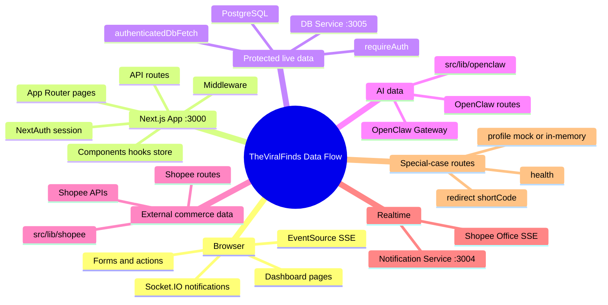
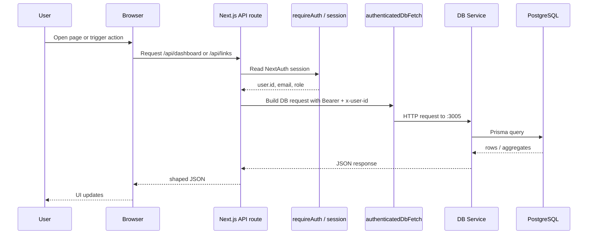
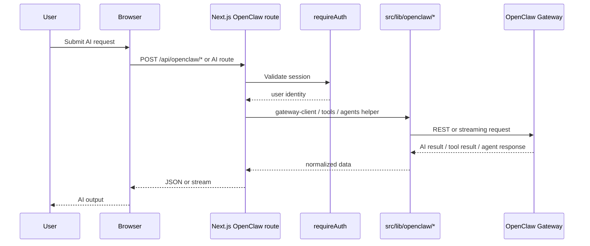
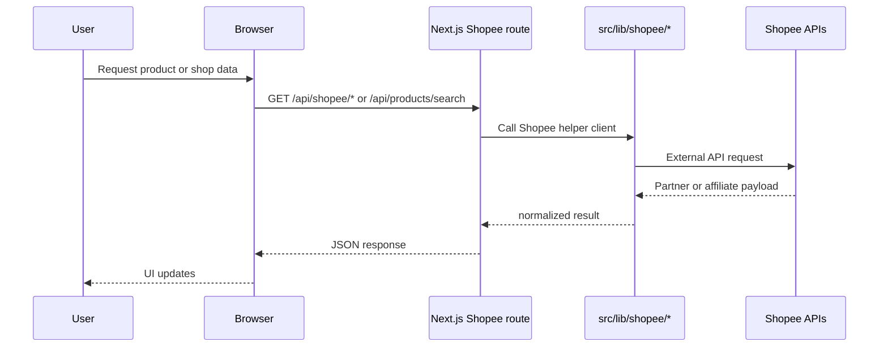
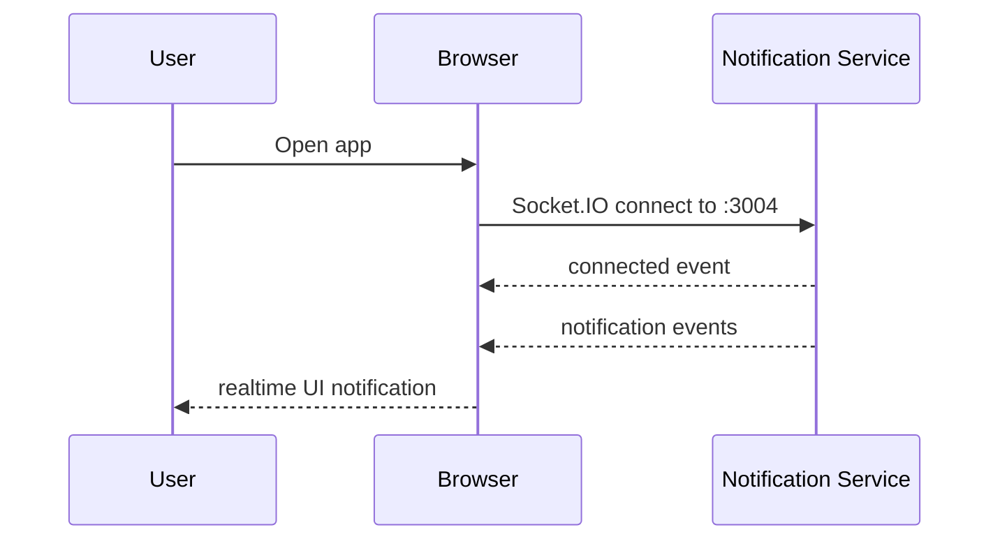
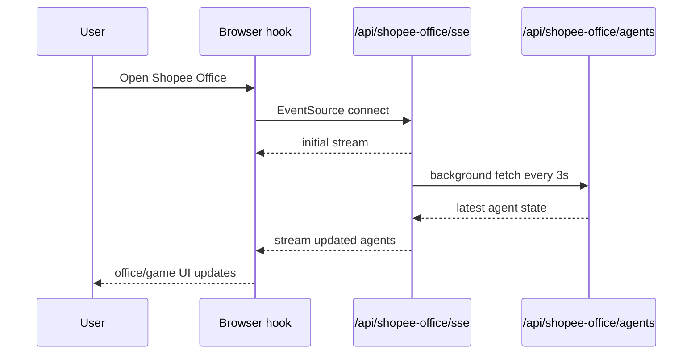
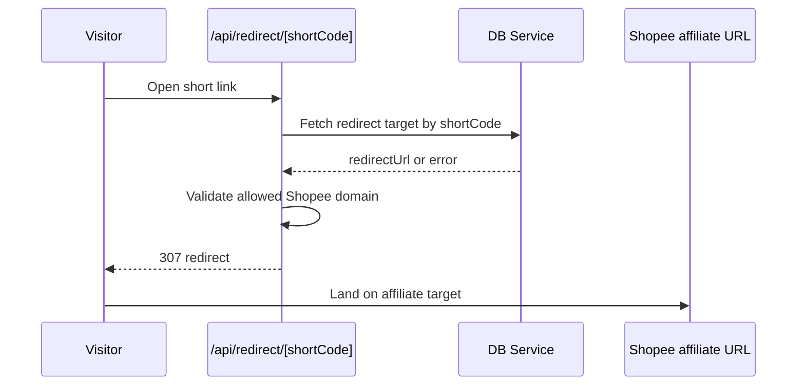
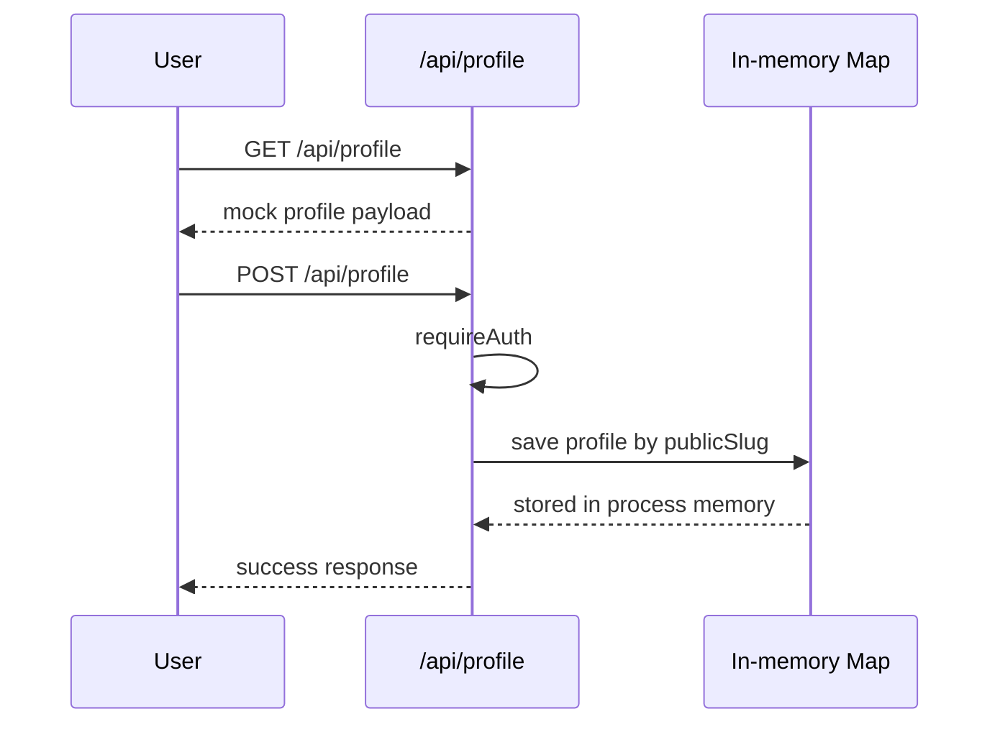

# Complete Data Flow

> End-to-end data flow map for TheViralFinds.
>
> Last verified against code on 15 April 2026.

---

## What this file answers

This file shows:

- where data starts
- which layer processes it
- whether it goes to DB service, OpenClaw, Shopee, or in-memory logic
- what comes back to the browser

Use this when you want the full flow, not just folder structure.

---

## Big-picture flow

```text
User / Browser
  ->
Next.js App (:3000)
  ->
  - Pages
  - Components
  - Hooks
  - API Routes
  - Auth / Middleware

Next.js API Routes
  -> DB Service (:3005) -> PostgreSQL
  -> OpenClaw Gateway
  -> Shopee APIs
  -> Notification Service (:3004) [browser realtime path]
  -> Local in-memory or special-case logic for a few routes

Response
  ->
Next.js JSON / redirect / SSE stream
  ->
Browser UI updates
```

---

## Data flow mindmap



---

## 1. Standard protected DB flow

This is the main live flow for dashboard, links, campaigns, payouts, goals, notifications, settings, and similar resources.



### Actual code path

```text
Browser
  -> src/app/(dashboard)/*
  -> client fetch to /api/*
  -> src/app/api/*/route.ts
  -> src/lib/api-auth.ts
  -> mini-services/db-service/index.ts
  -> prisma/schema.prisma backed tables in PostgreSQL
```

### Main route families that follow this pattern

- `/api/dashboard`
- `/api/links`
- `/api/campaigns`
- `/api/payouts`
- `/api/goals`
- `/api/notifications`
- `/api/settings`
- `/api/referral`

### Important note

This is the intended safe live path.
Some routes still drift from it and are tracked in `ROADMAP.md`, especially around auth/session shaping and missing DB endpoints.

---

## 2. AI and OpenClaw flow

This is the path for AI content generation, insights, analysis, tool use, and agent features.



### Actual code path

```text
Browser
  -> /api/openclaw/* or AI routes like /api/openclaw/ai-content
  -> src/lib/api-auth.ts
  -> src/lib/openclaw/gateway-client.ts
  -> src/lib/openclaw/tools.ts
  -> src/lib/openclaw/agents.ts
  -> OpenClaw Gateway
```

### Example

`/api/openclaw/ai-content`:

- checks `requireAuth()`
- rate-limits the request
- tries MCP tool execution first
- falls back to `openClawCompletion()`
- returns generated content to the browser

---

## 3. External Shopee API flow

This is the path for fetching Shopee products, shop info, affiliate data, AMS data, and related external commerce information.



### Actual code path

```text
Browser
  -> src/app/api/shopee/* or src/app/api/products/search
  -> src/lib/shopee/index.ts
  -> src/lib/shopee/*.ts clients
  -> Shopee external APIs
```

### Example

`/api/shopee/products`:

- checks whether Shopee config exists
- reads query params like `ids`, `offset`, `pageSize`
- calls product helper functions in `src/lib/shopee`
- returns raw product data plus derived `boostScore`

---

## 4. Notification realtime flow

This is separate from the DB service. It is a realtime transport path used directly by the browser.



### Actual code path

```text
Browser
  <-> mini-services/notification-service/index.ts
```

### Current reality

- service exists and streams events
- current implementation is mock-generated, not a persisted notification bus

---

## 5. Shopee Office SSE flow

This is a different realtime path from Socket.IO.
It uses `EventSource` and server-sent events.



### Actual code path

```text
Browser
  -> src/hooks/use-office-sse.ts
  -> /api/shopee-office/sse
  -> background self-fetch to /api/shopee-office/agents
  -> streamed events back to browser
```

### Current risk

- background sync currently fetches the agents route without forwarding auth
- this is one of the roadmap repair items

---

## 6. Public redirect flow

This is the short-link path used when someone opens an affiliate short code.



### Actual code path

```text
/api/redirect/[shortCode]
  -> DB Service /redirect/:shortCode
  -> allowlist validation
  -> HTTP 307 redirect
```

---

## 7. Profile special-case flow

This route does not currently follow the normal live DB-backed model.



### Current reality

- GET returns mock profile data
- POST stores to in-memory `Map`
- data does not survive restart
- middleware currently treats `/api/profile` as public

---

## 8. Where to see the full data picture

If you want the most complete view, open these in order:

1. [MASTER_STRUCTURE.md](./MASTER_STRUCTURE.md)
2. [COMPLETE_DATA_FLOW.md](./COMPLETE_DATA_FLOW.md)
3. [API_REFERENCE.md](./API_REFERENCE.md)
4. [DATABASE.md](./DATABASE.md)
5. [../ROADMAP.md](../ROADMAP.md)
6. [../prisma/schema.prisma](../prisma/schema.prisma)

If you want real database rows:

```bash
bunx prisma studio
```

---

## 9. Fast summary

```text
Most business data:
Browser -> Next.js API -> DB Service -> PostgreSQL -> Next.js -> Browser

AI data:
Browser -> Next.js API -> OpenClaw helpers -> OpenClaw Gateway -> Browser

Shopee data:
Browser -> Next.js API -> src/lib/shopee -> Shopee APIs -> Browser

Realtime notifications:
Browser <-> Notification Service

Realtime office state:
Browser -> SSE route -> self-fetch agents route -> Browser

Special-case route:
/api/profile still uses mock + in-memory behavior
```

---

*Last updated: 15 April 2026*
