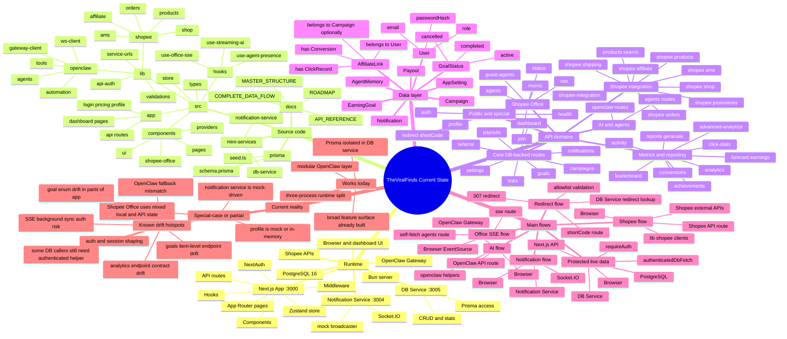

# Current Mindmap

> Complete current-state mindmap for TheViralFinds.
>
> Last verified against code on 15 April 2026.

---

## What this file is for

Use this file when you want one visual map of the project as it exists now:

- runtime architecture
- source-code layout
- API domains
- data ownership
- realtime paths
- special-case behavior
- current drift hotspots

This is about the current state, not the future roadmap.

---

## Current-state master mindmap



---

## Current state as text tree

```text
TheViralFinds Current State
├─ Runtime
│  ├─ Browser / Dashboard UI
│  ├─ Next.js App (:3000)
│  │  ├─ App Router pages
│  │  ├─ API routes
│  │  ├─ NextAuth
│  │  ├─ Middleware
│  │  ├─ Components
│  │  ├─ Hooks
│  │  └─ Zustand store
│  ├─ DB Service (:3005)
│  │  ├─ Bun server
│  │  ├─ Prisma access
│  │  └─ CRUD and stats
│  ├─ Notification Service (:3004)
│  │  ├─ Socket.IO
│  │  └─ mock broadcaster
│  ├─ PostgreSQL 16
│  ├─ OpenClaw Gateway
│  └─ Shopee APIs
│
├─ Source code
│  ├─ src/
│  │  ├─ app/
│  │  │  ├─ dashboard pages
│  │  │  ├─ api routes
│  │  │  └─ login / pricing / profile
│  │  ├─ components/
│  │  │  ├─ ui
│  │  │  ├─ pages
│  │  │  ├─ shopee-office
│  │  │  └─ providers
│  │  ├─ hooks/
│  │  ├─ lib/
│  │  │  ├─ api-auth
│  │  │  ├─ service-urls
│  │  │  ├─ validations
│  │  │  ├─ openclaw/
│  │  │  └─ shopee/
│  │  ├─ store/
│  │  └─ types/
│  ├─ mini-services/
│  │  ├─ db-service
│  │  └─ notification-service
│  ├─ prisma/
│  │  ├─ schema.prisma
│  │  └─ seed.ts
│  └─ docs/
│     ├─ MASTER_STRUCTURE
│     ├─ COMPLETE_DATA_FLOW
│     ├─ API_REFERENCE
│     └─ ROADMAP
│
├─ API domains
│  ├─ Core DB-backed routes
│  │  ├─ dashboard
│  │  ├─ links
│  │  ├─ campaigns
│  │  ├─ payouts
│  │  ├─ goals
│  │  ├─ notifications
│  │  ├─ settings
│  │  └─ referral
│  ├─ Metrics and reporting
│  │  ├─ analytics
│  │  ├─ advanced-analytics
│  │  ├─ click-stats
│  │  ├─ conversions
│  │  ├─ activity
│  │  ├─ leaderboard
│  │  ├─ achievements
│  │  ├─ forecast earnings
│  │  └─ reports generate
│  ├─ AI and agents
│  │  ├─ openclaw routes
│  │  └─ agents routes
│  ├─ Shopee Office
│  │  ├─ status
│  │  ├─ join
│  │  ├─ agents
│  │  ├─ memo
│  │  ├─ sse
│  │  └─ guest-agents
│  ├─ Shopee integration
│  │  ├─ shopee products
│  │  ├─ shopee shop
│  │  ├─ shopee orders
│  │  ├─ shopee affiliate
│  │  ├─ shopee ams
│  │  ├─ shopee promotions
│  │  ├─ shopee shipping
│  │  ├─ shopee-integration
│  │  └─ products search
│  └─ Public and special
│     ├─ auth
│     ├─ health
│     ├─ profile
│     └─ redirect shortCode
│
├─ Data layer
│  ├─ User
│  ├─ AffiliateLink
│  │  ├─ belongs to User
│  │  ├─ belongs to Campaign optionally
│  │  ├─ has ClickRecord
│  │  └─ has Conversion
│  ├─ Campaign
│  ├─ Payout
│  ├─ AppSetting
│  ├─ EarningGoal
│  ├─ Notification
│  ├─ AgentMemory
│  └─ GoalStatus
│     ├─ active
│     ├─ completed
│     └─ cancelled
│
├─ Main flows
│  ├─ Protected live data
│  │  └─ Browser -> Next.js API -> requireAuth -> authenticatedDbFetch -> DB Service -> PostgreSQL
│  ├─ AI flow
│  │  └─ Browser -> OpenClaw API route -> openclaw helpers -> OpenClaw Gateway
│  ├─ Shopee flow
│  │  └─ Browser -> Shopee API route -> lib/shopee clients -> Shopee external APIs
│  ├─ Notification flow
│  │  └─ Browser <-> Notification Service via Socket.IO
│  ├─ Office SSE flow
│  │  └─ Browser EventSource -> sse route -> self-fetch agents route
│  └─ Redirect flow
│     └─ shortCode route -> DB Service redirect lookup -> allowlist validation -> 307 redirect
│
└─ Current reality
   ├─ Works today
   │  ├─ three-process runtime split
   │  ├─ Prisma isolated in DB service
   │  ├─ modular OpenClaw layer
   │  └─ broad feature surface already built
   ├─ Special-case or partial
   │  ├─ profile is mock or in-memory
   │  ├─ notification service is mock-driven
   │  └─ Shopee Office uses mixed local and API state
   └─ Known drift hotspots
      ├─ auth and session shaping
      ├─ some DB callers still need authenticated helper
      ├─ analytics endpoint contract drift
      ├─ goals item-level endpoint drift
      ├─ OpenClaw fallback mismatch
      ├─ SSE background sync auth risk
      └─ goal enum drift in parts of app
```

---

## Best companion docs

- [MASTER_STRUCTURE.md](./MASTER_STRUCTURE.md)
- [COMPLETE_DATA_FLOW.md](./COMPLETE_DATA_FLOW.md)
- [API_REFERENCE.md](./API_REFERENCE.md)
- [DATABASE.md](./DATABASE.md)
- [../ROADMAP.md](../ROADMAP.md)

---

*Last updated: 15 April 2026*
