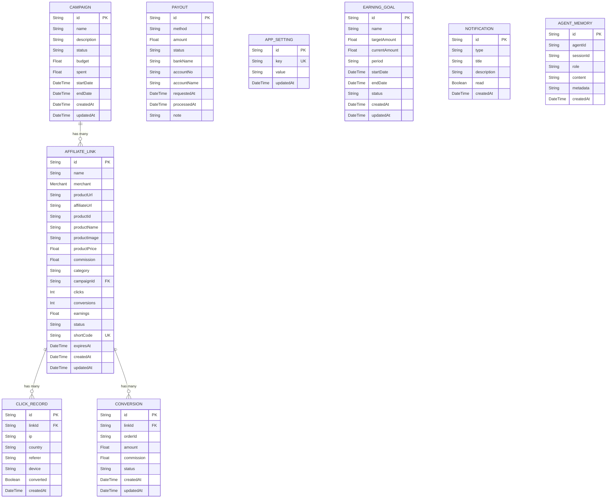

# Database

> PostgreSQL 16 database schema, ERD, and migration history for TheViralFinds.

> Reality check (15 April 2026):
> `prisma/schema.prisma` is the authoritative source for exact types, enums, indexes, and relations. Some shorthand tables below are legacy summaries and may omit `userId`, enum values, or `Decimal` types.

---

## Overview

- **Database**: PostgreSQL 16
- **ORM**: Prisma v6.11.1
- **Schema Location**: `prisma/schema.prisma`
- **Migrations**: `prisma/migrations/`
- **Current Models**: 9 models including `User`

---

## Entity Relationship Diagram

This ERD is simplified. It does not fully show the current `User` relations or every schema-level detail.



---

## Models

Important:

- Tenant-owned models in the current schema include `userId` foreign keys.
- Money-related fields in the current schema use `Decimal`, even where older summaries below say `Float`.
- `AppSetting` currently uses a composite unique constraint on `[userId, key]`.
- `GoalStatus` in the current schema is `active | completed | cancelled`, even though some route logic still drifts and uses `achieved`.

### 1. AffiliateLink

Core entity representing a Shopee affiliate product link.

| Field | Type | Description |
|-------|------|-------------|
| `id` | String (cuid) | Primary key |
| `name` | String | Link display name |
| `merchant` | Enum | SHOPEE, LAZADA, TIKTOK_SHOP, AMAZON |
| `productUrl` | String | Original product URL |
| `affiliateUrl` | String | Affiliate tracking URL |
| `productId` | String? | Product identifier |
| `productName` | String? | Product name |
| `productImage` | String? | Product image URL |
| `productPrice` | Float? | Product price |
| `commission` | Float? | Commission rate/amount |
| `category` | String? | Product category |
| `campaignId` | String? | FK to Campaign |
| `clicks` | Int | Total click count |
| `conversions` | Int | Total conversion count |
| `earnings` | Float | Total earnings |
| `status` | String | active, paused, expired |
| `shortCode` | String | Unique redirect code |
| `expiresAt` | DateTime? | Link expiry date |
| `createdAt` | DateTime | Auto-generated |
| `updatedAt` | DateTime | Auto-updated |

**Indexes**: `status`, `campaignId`, `category`, `createdAt`

**Relations**:

- `campaign`: Campaign? (optional, SetNull on delete)
- `clickRecords`: ClickRecord[] (Cascade on delete)
- `conversionRecords`: Conversion[] (Cascade on delete)

### 2. Campaign

Groups affiliate links into marketing campaigns.

| Field | Type | Description |
|-------|------|-------------|
| `id` | String (cuid) | Primary key |
| `name` | String | Campaign name |
| `description` | String? | Campaign description |
| `status` | String | active, paused, completed |
| `budget` | Float? | Campaign budget |
| `spent` | Float | Amount spent |
| `startDate` | DateTime? | Campaign start |
| `endDate` | DateTime? | Campaign end |
| `createdAt` | DateTime | Auto-generated |
| `updatedAt` | DateTime | Auto-updated |

**Relations**:

- `links`: AffiliateLink[] (SetNull on delete)

### 3. ClickRecord

Tracks individual click events on affiliate links.

| Field | Type | Description |
|-------|------|-------------|
| `id` | String (cuid) | Primary key |
| `linkId` | String | FK to AffiliateLink |
| `ip` | String? | User IP address |
| `country` | String? | User country |
| `referer` | String? | Traffic source |
| `device` | String? | Device type |
| `converted` | Boolean | Whether click converted |
| `createdAt` | DateTime | Auto-generated |

**Indexes**: `linkId`, `createdAt`, `device`

**Relations**:

- `affiliateLink`: AffiliateLink (Cascade on delete)

### 4. Conversion

Tracks conversion events (sales) from affiliate links.

| Field | Type | Description |
|-------|------|-------------|
| `id` | String (cuid) | Primary key |
| `linkId` | String | FK to AffiliateLink |
| `orderId` | String? | Order identifier |
| `amount` | Float | Order amount |
| `commission` | Float | Commission earned |
| `status` | String | pending, confirmed, rejected, paid |
| `createdAt` | DateTime | Auto-generated |
| `updatedAt` | DateTime | Auto-updated |

**Indexes**: `linkId`, `status`, `createdAt`

**Relations**:

- `affiliateLink`: AffiliateLink (Cascade on delete)

### 5. Payout

Tracks payout requests and processing.

| Field | Type | Description |
|-------|------|-------------|
| `id` | String (cuid) | Primary key |
| `method` | String | bank_transfer, ewallet |
| `amount` | Float | Payout amount |
| `status` | String | pending, processing, completed, failed |
| `bankName` | String? | Bank name |
| `accountNo` | String? | Account number |
| `accountName` | String? | Account holder name |
| `requestedAt` | DateTime | Auto-generated |
| `processedAt` | DateTime? | Processing timestamp |
| `note` | String? | Additional notes |

**Indexes**: `status`, `requestedAt`

### 6. AppSetting

Key-value configuration store.

| Field | Type | Description |
|-------|------|-------------|
| `id` | String (cuid) | Primary key |
| `key` | String | Unique setting key |
| `value` | String | Setting value |
| `updatedAt` | DateTime | Auto-updated |

### 7. EarningGoal

Tracks user earning targets.

| Field | Type | Description |
|-------|------|-------------|
| `id` | String (cuid) | Primary key |
| `name` | String | Goal name |
| `targetAmount` | Float | Target earnings |
| `currentAmount` | Float | Current progress |
| `period` | String | monthly, weekly, yearly, custom |
| `startDate` | DateTime | Goal start date |
| `endDate` | DateTime? | Goal end date |
| `status` | String | active, achieved |
| `createdAt` | DateTime | Auto-generated |
| `updatedAt` | DateTime | Auto-updated |

**Indexes**: `status`, `period`

### 8. Notification

User notifications.

| Field | Type | Description |
|-------|------|-------------|
| `id` | String (cuid) | Primary key |
| `type` | String | system, conversion, payout |
| `title` | String | Notification title |
| `description` | String | Notification body |
| `read` | Boolean | Read status |
| `createdAt` | DateTime | Auto-generated |

**Indexes**: `read`, `createdAt`, `type`

### 9. AgentMemory

Stores AI agent conversation history.

| Field | Type | Description |
|-------|------|-------------|
| `id` | String (cuid) | Primary key |
| `agentId` | String | AI agent identifier |
| `sessionId` | String? | Conversation session |
| `role` | String | user, assistant, system |
| `content` | String | Message content |
| `metadata` | String? | JSON metadata |
| `createdAt` | DateTime | Auto-generated |

**Indexes**: `agentId`, `sessionId`, `createdAt`

---

## Current Schema Status

The schema has already moved past the old single-tenant design:

- `User` and `Role` are present in `prisma/schema.prisma`
- tenant-owned models already contain `userId`
- composite uniqueness exists where needed, for example `AppSetting @@unique([userId, key])`

What is still incomplete is not the schema shape itself, but route-layer and documentation alignment:

- some API and DB-service handlers still behave as if the pre-user-model world exists
- some docs still describe the old schema
- some UI/business logic still drifts from the current enums

---

## Migration History

| Migration | Date | Description |
|-----------|------|-------------|
| Initial schema | - | Created 8 models |
| *(No migrations recorded yet)* | | Prisma db push used instead |

**Note**: The project still uses `prisma db push` in development in several places, but staging/production guidance should prefer migrations and explicit rollout steps.

---

## Commands

```bash
# Generate Prisma Client
bun run db:generate

# Push schema changes to database (development)
bun run db:push

# Create a new migration
bun run db:migrate -- --name <migration-name>

# Reset database (development only - destroys data)
bun run db:reset
```

---

## DB Service Architecture

The DB Service (`mini-services/db-service/index.ts`) provides HTTP access to Prisma:

- Runs on `http://127.0.0.1:3005` (localhost only)
- Uses `Bun.serve()` for HTTP server
- Imports Prisma Client directly from `node_modules/.prisma/client`
- Provides the current database route surface used by the Next.js app
- Requires `DB_SERVICE_SECRET` bearer auth at startup in the current implementation

**Why a separate service?**
Next.js 16 + Turbopack hangs when compiling Prisma Client. The DB Service runs as a separate Bun process, completely isolated from Turbopack's compilation pipeline.

---

*Last updated: 15 April 2026*
