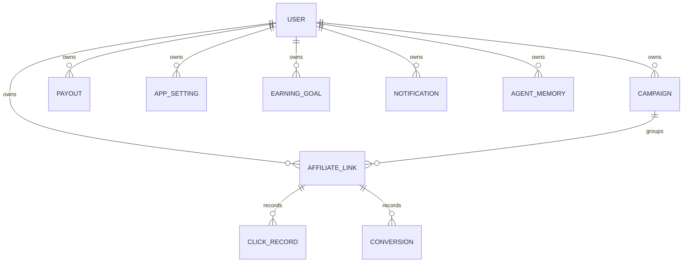
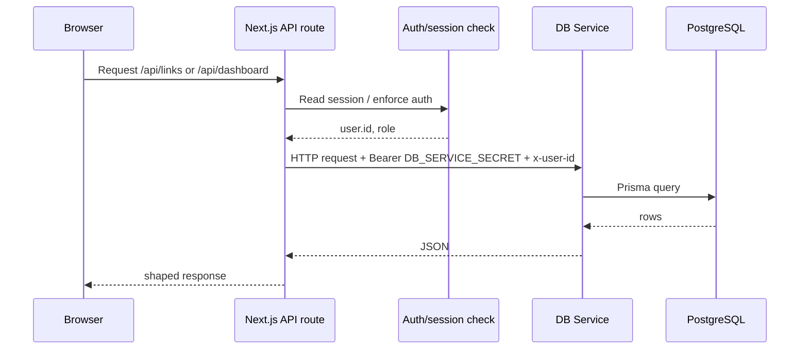
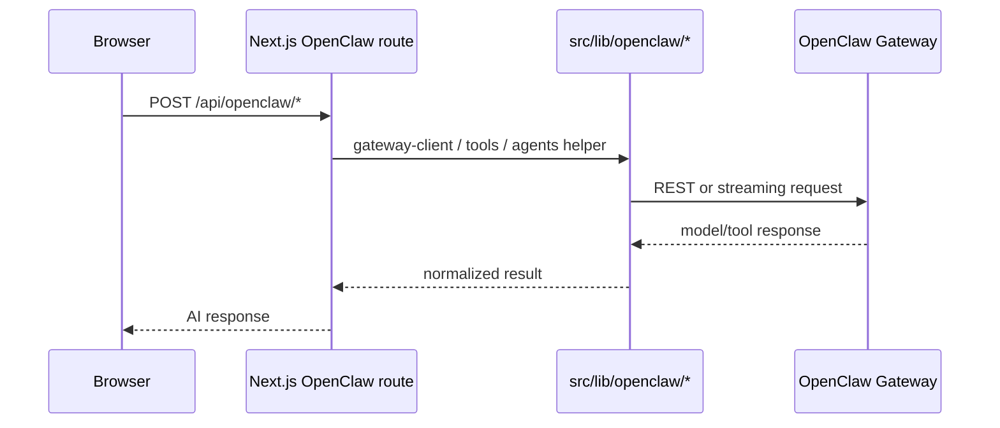
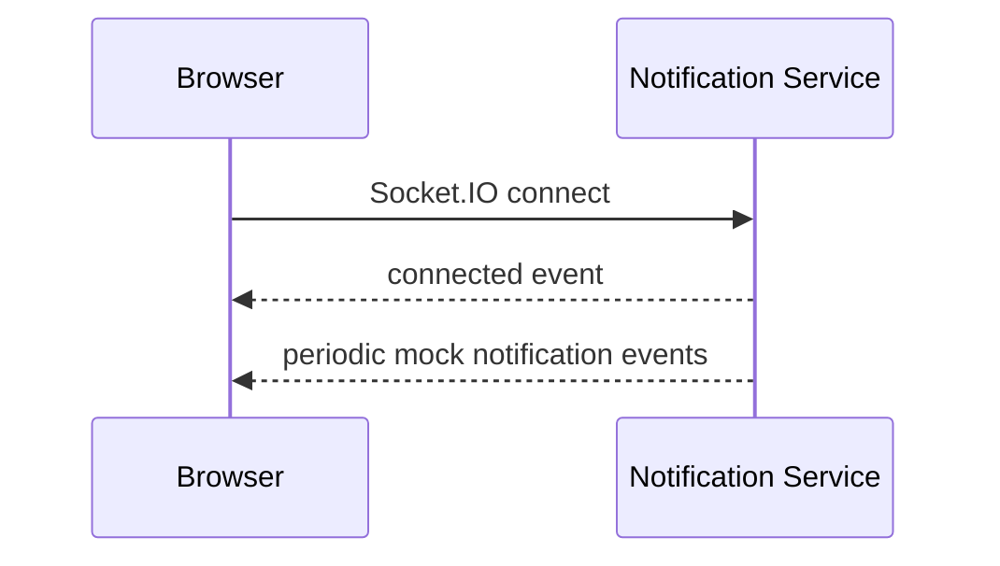

# Master Structure

> Single-entry map for the actual runtime structure of TheViralFinds.
>
> Last verified against code on 15 April 2026.
>
> Use this file first when you want to answer:
> "How is this project really wired together right now?"

---

## What Is Authoritative

This file is a navigation map, not the final contract for every route.

When there is any mismatch, trust these files in this order:

1. `prisma/schema.prisma`
2. `mini-services/db-service/index.ts`
3. `src/app/api/**`
4. `src/lib/openclaw/**`
5. `src/lib/service-urls.ts`
6. `ROADMAP.md`

---

## Runtime System Map

```mermaid
flowchart LR
  Browser[Browser / Dashboard UI]

  subgraph Next[Next.js App :3000]
    Pages[App Router pages\nsrc/app/(dashboard), login, pricing, profile]
    Api[API routes\nsrc/app/api/**]
    Auth[NextAuth + middleware\nsrc/app/api/auth/*\nmiddleware.ts]
    Frontend[Components + hooks + Zustand\nsrc/components\nsrc/hooks\nsrc/store]
  end

  subgraph Services[Mini-services]
    DB[DB Service :3005\nBun + Prisma\nmini-services/db-service]
    Notif[Notification Service :3004\nSocket.IO\nmock notification broadcaster]
  end

  Postgres[(PostgreSQL 16)]
  OpenClaw[OpenClaw Gateway\noperator.gangniaga.my]
  Shopee[Shopee APIs\nPartner + Affiliate]

  Browser --> Pages
  Pages --> Frontend
  Frontend --> Api
  Auth --> Api
  Api --> DB
  DB --> Postgres
  Browser <--> Notif
  Api --> OpenClaw
  Api --> Shopee
```

### Short reading

- `Next.js :3000` is the main app shell, UI layer, auth layer, and API facade.
- `DB Service :3005` is the database execution layer because Prisma is isolated from Next.js/Turbopack.
- `Notification Service :3004` is a separate Socket.IO process and is currently mock-driven.
- `OpenClaw Gateway` is the AI integration backend used by `/api/openclaw/*`.
- `Shopee APIs` are called from Shopee-related routes and helper clients under `src/lib/shopee/`.

---

## Codebase Map

```text
src/
  app/
    (dashboard)/         dashboard pages
    api/                 HTTP facade grouped by domain
    login/ pricing/ profile/
  components/
    ui/                  shadcn/ui primitives
    pages/               page-level UI
    shopee-office/       Phaser office/game + control panels
    providers/           session, query, theme, notifications, PWA
  hooks/                 browser and streaming hooks
  lib/
    openclaw/            AI gateway client, tools, agents, WS
    shopee/              Shopee partner + affiliate clients
    api-auth.ts          auth helpers for API routes
    service-urls.ts      central external/local service endpoints
    validations.ts       shared Zod schemas
    cache*/ rate-limit*  cache and throttling helpers
  store/                 Zustand app state
  types/                 NextAuth typing

mini-services/
  db-service/            Bun server + Prisma-backed CRUD/read models
  notification-service/  Socket.IO notification stream

prisma/
  schema.prisma          source of truth for models, enums, relations
  seed.ts                seed script
```

---

## Domain Ownership Map

| Area | Main entry paths | Real backend behind it | Notes |
|---|---|---|---|
| Core affiliate data | `/api/dashboard`, `/api/links`, `/api/campaigns`, `/api/activity`, `/api/notifications`, `/api/payouts`, `/api/settings`, `/api/referral`, `/api/goals`, `/api/leaderboard`, `/api/achievements` | `mini-services/db-service/index.ts` + PostgreSQL | This is the main live data path. |
| Auth | `/api/auth/[...nextauth]`, `middleware.ts` | NextAuth session/JWT | Session shaping still needs careful verification in live mode. |
| AI / agents | `/api/openclaw/*`, `/api/agents/*` | `src/lib/openclaw/*` -> OpenClaw Gateway | Dynamic discovery should come from gateway, not hardcoded lists. |
| Shopee integrations | `/api/shopee/*`, `/api/products/search`, `/api/shopee-integration/*` | `src/lib/shopee/*` -> Shopee APIs | External network dependency. |
| Shopee Office / game | `/api/shopee-office/*` + `src/components/shopee-office/*` | Mixed local state, SSE, browser game loop, and app routes | Not all paths are DB-backed. |
| Real-time notifications | browser Socket.IO client | `mini-services/notification-service/index.ts` | Current implementation is mock broadcaster, not a persisted event bus. |
| Redirect / public profile | `/api/redirect/[shortCode]`, `/api/profile`, `/profile/[slug]` | Mixed special-case route logic | Verify behavior directly in code before assuming these follow the standard live path. |

---

## Core Data Shape

This is the simplified live ownership model from `prisma/schema.prisma`.



### Important live rules

- `User` now exists in schema and tenant-owned models carry `userId`.
- `AffiliateLink`, `Campaign`, `Payout`, `AppSetting`, `EarningGoal`, `Notification`, and `AgentMemory` are user-owned.
- `ClickRecord` and `Conversion` hang off `AffiliateLink`.
- Goal status in schema is `active | completed | cancelled`.

---

## Main Request Flows

### 1. Standard authenticated data flow



### 2. AI request flow



### 3. Notification flow



---

## Current Reality Notes

- The repo is architected around a real 3-process split, but not every route currently follows the ideal contract cleanly.
- `DB Service` is a hard runtime dependency for most core data routes.
- `Notification Service` is currently real-time transport with mock-generated events.
- `OpenClaw` lives behind helper modules in `src/lib/openclaw/`; treat fallback behavior as something to verify before depending on it.
- Some routes in `src/app/api/**` still have auth drift or route-contract drift. `ROADMAP.md` tracks the repair order.
- `src/lib/service-urls.ts` is the central place to understand which services are local and which are external.

---

## Where To Dive Next

- Current-state mindmap: [CURRENT_MINDMAP.md](./CURRENT_MINDMAP.md)
- System-level architecture: [ARCHITECTURE.md](./ARCHITECTURE.md)
- End-to-end data flow: [COMPLETE_DATA_FLOW.md](./COMPLETE_DATA_FLOW.md)
- Database details and schema notes: [DATABASE.md](./DATABASE.md)
- AI/OpenClaw integration: [AI_ARCHITECTURE.md](./AI_ARCHITECTURE.md)
- API route reference: [API_REFERENCE.md](./API_REFERENCE.md)
- Execution priorities and known drift: [../ROADMAP.md](../ROADMAP.md)

---

*Last updated: 15 April 2026*
