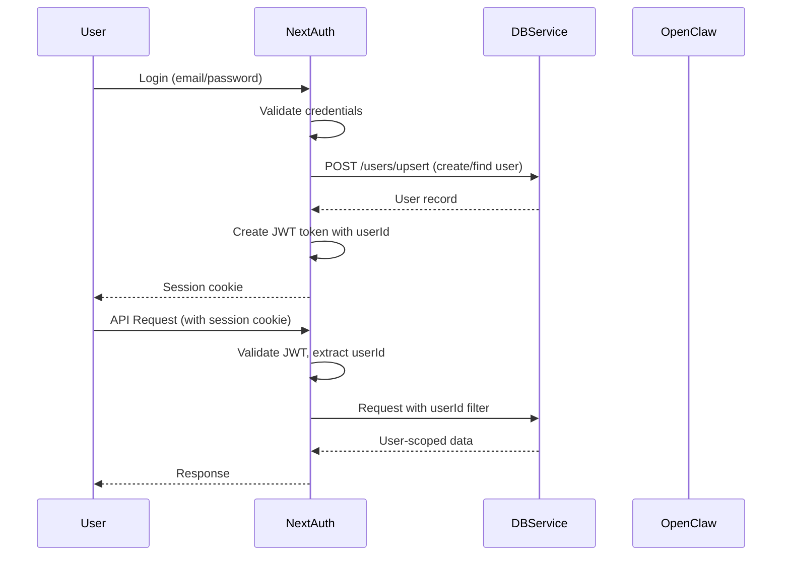

# Security

> Security measures, known issues, and vulnerability reporting for TheViralFinds.

> Reality check (15 April 2026):
> This file is now focused on verified current-state risks. Older audit snapshots still exist elsewhere, but they should not be treated as the live security truth without checking the code.

---

## Reporting Vulnerabilities

If you discover a security vulnerability, please:

1. **Do not** open a public GitHub issue
2. Email: <security@theviralfinds.my> (if configured)
3. Include detailed steps to reproduce the vulnerability
4. Include potential impact assessment

---

## Implemented Security Measures

| Measure | Status | Description |
|---------|--------|-------------|
| **Security Headers** | ✅ | CSP, HSTS, X-Frame-Options, X-Content-Type-Options, XSS Protection, Referrer-Policy, Permissions-Policy |
| **Authentication** | ✅ | NextAuth.js with JWT sessions |
| **OAuth Allowlist** | ✅ | Email domain validation for Google/Facebook login |
| **Input Validation** | ✅ | Zod schemas on all API endpoints |
| **Rate Limiting** | ⚠️ | Present, but not uniformly reliable across every live path and service |
| **Environment Validation** | ✅ | Fail-fast on missing required env vars |
| **CORS (DB Service)** | ✅ | Restricted to localhost origins |
| **Bearer Auth (DB Service)** | ✅ | DB service now requires `DB_SERVICE_SECRET` at startup |
| **HTTPS (Production)** | ✅ | HSTS header with preload |
| **Type Safety** | ⚠️ | TypeScript strict mode is enabled, but some assertions and drift remain |

---

## Critical Issues (P0) — Resolved

### ✅ Hardcoded Admin Email

**Status**: Fixed  
**Severity**: Critical  
**Discovery**: 4/5 audit agents  
**Fix**: Moved `ADMIN_EMAIL` to environment variable with validation in `src/lib/env.ts`. Default fallback: `admin@theviralfinds.my`.

### ✅ Missing Security Headers

**Status**: Fixed  
**Severity**: Critical  
**Discovery**: 3/5 audit agents  
**Fix**: Added 8 security headers to `next.config.ts`:

- Content-Security-Policy (CSP)
- Strict-Transport-Security (HSTS)
- X-Frame-Options
- X-Content-Type-Options
- X-XSS-Protection
- Referrer-Policy
- Permissions-Policy
- X-DNS-Prefetch-Control

---

## Known Issues

### P0: Auth and session shaping drift

**Severity**: Critical  
**Impact**: OAuth and credentials flows can diverge, leaving protected routes without a trustworthy `session.user.id` or role context.  
**Status**: ⬜ Open  
**Fix**: Normalize user upsert, JWT payload, and session shaping in `src/app/api/auth/[...nextauth]/route.ts` and `src/lib/api-auth.ts`.

### P0: Live DB-service callers still drift from auth expectations

**Severity**: Critical  
**Impact**: Some Next.js routes still call the DB service without the authenticated helper, which can produce 401/500 failures or weak tenant scoping in live mode.  
**Status**: ⬜ Open  
**Fix**: Normalize all DB-service callers around `authenticatedDbFetch()` and verified user context.

### P0: Route contract drift between Next.js and DB service

**Severity**: Critical  
**Impact**: Routes such as analytics and item-level goal operations can fail even when auth succeeds, because the backend contract is incomplete or mismatched.  
**Status**: ⬜ Open  
**Fix**: Align `src/app/api/**` callers with real DB-service endpoints or add the missing endpoints.

### P1: `/api/profile` is still misleading

**Severity**: High  
**Impact**: Middleware currently treats `/api/profile` as public while the route still uses mock/in-memory behavior. This is a security and trust boundary problem.  
**Status**: ⬜ Open  
**Fix**: Either secure and persist the feature properly, or clearly mark it as non-production.

### P1: OpenClaw fallback path needs verification

**Severity**: High  
**Impact**: `src/lib/openclaw/tools.ts` imports `getSDK` from `gateway-client`, but the current export contract still needs correction. This weakens degraded-mode confidence.  
**Status**: ⬜ Open  
**Fix**: Repair the import/export contract and add fallback tests.

### P1: Test coverage still under-protects live behavior

**Severity**: Medium  
**Impact**: Live-mode auth, DB contracts, and AI fallback paths can regress without detection because coverage is still concentrated in lower-risk utility areas.  
**Status**: ⬜ Open  
**Fix**: Prioritize route and DB-service tests that run with auth enabled and demo mode disabled.

---

## Environment Variable Sensitivity

| Variable | Sensitivity | Required | Description |
|----------|-------------|----------|-------------|
| `DATABASE_URL` | 🔴 Critical | ✅ | PostgreSQL connection string |
| `NEXTAUTH_SECRET` | 🔴 Critical | ✅ | JWT signing key |
| `ADMIN_PASSWORD` | 🔴 Critical | ✅ | Admin account password |
| `OPENCLAW_GATEWAY_TOKEN` | 🔴 Critical | ✅ | AI gateway authentication |
| `DB_SERVICE_SECRET` | 🟡 High | Optional | DB service bearer token |
| `SHOPEE_PARTNER_KEY` | 🟡 High | Optional | Shopee API secret |
| `SHOPEE_AFFILIATE_SECRET` | 🟡 High | Optional | Affiliate API secret |
| `GOOGLE_CLIENT_SECRET` | 🟡 High | Optional | OAuth client secret |
| `FACEBOOK_CLIENT_SECRET` | 🟡 High | Optional | OAuth client secret |
| `TELEGRAM_BOT_TOKEN` | 🟡 High | Optional | Telegram bot token |
| `TWILIO_AUTH_TOKEN` | 🟡 High | Optional | Twilio authentication |
| `ADMIN_EMAIL` | 🟢 Low | ✅ | Admin email address |
| `NEXTAUTH_URL` | 🟢 Low | Optional | Base URL for auth |
| `DEMO_MODE` | 🟢 Low | ✅ | Enable demo data |
| `SKIP_AUTH` | 🟢 Low | ✅ | Bypass auth (dev only) |

**Rules**:

- Never commit `.env` to Git
- Use `.env.example` as template
- Store production secrets in Vercel dashboard or VPS environment
- Rotate secrets regularly

---

## Security Headers Configuration

Located in `next.config.ts`:

```typescript
const securityHeaders = [
  { key: 'X-DNS-Prefetch-Control', value: 'on' },
  { key: 'Strict-Transport-Security', value: 'max-age=63072000; includeSubDomains; preload' },
  { key: 'X-Frame-Options', value: 'SAMEORIGIN' },
  { key: 'X-Content-Type-Options', value: 'nosniff' },
  { key: 'X-XSS-Protection', value: '1; mode=block' },
  { key: 'Referrer-Policy', value: 'origin-when-cross-origin' },
  { key: 'Permissions-Policy', value: 'camera=(), microphone=(), geolocation=()' },
  { key: 'Content-Security-Policy', value: "default-src 'self'; script-src 'self' 'unsafe-eval' 'unsafe-inline' https://cdn.jsdelivr.net; ..." },
]
```

---

## Authentication Flow



---

## Best Practices

### For Developers

1. Never commit secrets to Git
2. Use `.env.example` as reference
3. Run `bun run lint` before committing
4. Validate all inputs with Zod
5. Use `openclaw/<agentId>` format (never `niaga-default`)
6. Never expose Prisma Client in Next.js routes
7. Filter all queries by userId (after multi-tenancy)

### For Deployment

1. Set `DEMO_MODE=false` in production
2. Set `SKIP_AUTH=false` in production
3. Configure `DB_SERVICE_SECRET` for DB Service auth
4. Use HTTPS with valid certificates
5. Restrict VPS firewall to localhost for DB Service (port 3005)
6. Enable nginx reverse proxy for external access
7. Rotate NextAuth secret periodically

---

## Audit History

| Date | Auditor | Score | Key Findings |
|------|---------|-------|-------------|
| 12 April 2026 | Qwen Code | 61/100 (C+) | 8 unique security findings, architectural debt analysis |
| 12 April 2026 | Claude Code (Opus 4.6) | 69/100 (B-) | 10 unique bugs (Math.random, process.exit, mass assignment) |
| 12 April 2026 | Antigravity (Opus) | 69/100 (B-) | Architecture mapping with progress tracking |
| 12 April 2026 | Gemini CLI | — | Brain directory optimization, polling→WS migration |
| 12 April 2026 | OpenAI Codex | — | Knowledge management system review |

**Consensus Score**: ~65/100 (C+)

---

*Last updated: 15 April 2026*
